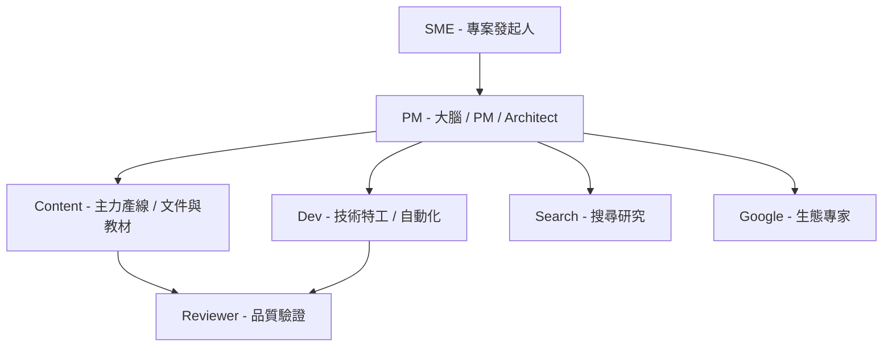
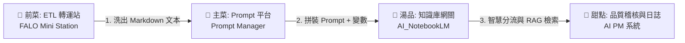

# Skyline Class02 專案啟動說明

歡迎來到 **Skyline Class02**。這是一個針對企業內訓的案例專案，旨在向企業主管展示：**AI 如何從簡單的聊天/問答工具，演進為企業工作流系統的一環。**

---

## 👥 Skyline 團隊與定位

我們不把 AI 視為單一的對話框，而是將其組建為一個**合理分工的虛擬團隊**。請理解以下角色定位，這也是本課程的核心展示架構：

### 角色職掌與定位明細

| 角色角色 | 角色定位 (AI Persona) | 核心強項與職掌範圍 |
| :--- | :--- | :--- |
| **SME** | 專案發起人 (Domain Expert) | 提供核心 Know-how、實務需求、架構方向與顧問觀點。 |
| **PM** | **大腦 / PM / Architect** | 核心價值在於**長期記憶、專案脈絡管理、角色關係、架構整合與跨專案連結**。 |
| **Content** | **主力產線** | 專注於 **Agent-First** 模式。負責**長文件寫作、教材工程、HTML/CSS 展示、GitHub Pages、工作台與 Artifact 管理**。 |
| **Dev** | **技術特工** | 專注於 **Python、Automation、API、Runtime、工具開發與技術驗證**。在 Content 卡住或完成規格後進行實作補位。 |
| **Search** | **搜尋研究員** | 負責網頁深度搜尋與背景資料研究。 |
| **Google** | **Google 生態系專家** | 專注於 Google 生態系工具（如 Google Workspace、Docs、GAS 等）的深度整合。 |
| **Reviewer** | **品質驗證人 (Reviewer)** | 尋找漏洞、分析風險、挑戰既有假設以確保交付品質。 |

---

## ⚡ 新協作原則：GitHub 共享記憶體 (Shared Workspace)

**本地資料夾 + GitHub Repo 雙工作台模式：**
* **PM (大腦/架構師)**：大腦協調。可直接在 GitHub 上協作，建立文件骨架、維護 README、更新 md 教材與補充治理文件。但無權限建立 Repo。
* **Content (主力產線)**：主力產線。負責本地與 GitHub 的同步、建立 Repo、HTML 渲染與 Artifact 品質控管。

---

## 🎯 課程核心：以最小成本組出一個 AI 團隊

Skyline 這堂課要展示的，**不是哪一個 AI 最強，而是如何用最小的成本，組出一個合理的 AI 團隊。**

這解決了中小企業與個人發起人 (SME) 最在意的痛點：
> **「我只有一個人、一台電腦、一點預算，能不能開始用 AI 工作流？」**

我們的答案是：**可以。不需要追求單一的最強 AI，只要透過合理的分工與共享記憶體（GitHub），就能用極低的成本跑起高效的企業工作流。**

---

## 🍱 FALO 模型菜組合包範例：企業智能投標工作流

為幫助學員與企業主管（如辜總、陳董）直觀理解，我們將前述所有獨立模組（ETL、Prompt、RAG、PM）串接，形成一套完整的 **「FALO 模型菜組合包 (Set Meal)」** 實戰範例：

1. **🥗 前菜：資料前置清洗與 ETL (FALO Mini Station)**
   * **功能**：同仁複製混亂的客戶投標需求（RFP），或直接截圖上傳。
   * **輸出**：Mini Station 執行輕量級 OCR 與 ETL 清洗，自動過濾雜訊，產出結構乾淨的 Markdown 格式文本。
2. **🍲 主菜：指令包裝與變數代入 (FALO Prompt Manager)**
   * **功能**：調用 Prompt 平台內建的 `[標前需求預判 Checklist]` 範本，自動套入變數（如公司名稱、技術參數）。
   * **輸出**：拼裝成上下文完整、語意清晰、免去人工手動複製修改的「高精度 Prompt」。
3. **🍛 湯品：智慧分流與安全檢索 (AI_NotebookLM 網關)**
   * **功能**：將 Prompt 自動發送至網關後端。網關先向 `Master Router Notebook` 提問解析：「該問哪個書庫？」隨後將問題投遞至目標書庫（如：歷史得標案例庫）進行檢索。
   * **輸出**：安全取得經由沙盒保護的標案可行性評估，同仁接觸不到敏感的原始文件。
4. **🍨 甜點：日誌合規與進度管控 (AI PM 系統)**
   * **功能**：網關在執行問答時，自動透過 GAS 將對話內容與 FinOps Token 費用記錄在 Google Sheet 資料庫中，並由 AI PM 自動更新專案追蹤進度與交付成果稽核。
   * **輸出**：產出透明、合規的專案進度與成本控管日誌。

---

## 📦 核心教學知識骨架 (Class 02 Antigravity 核心交付包)

我們已將講師 **ff (Force)** 顧問實戰沉澱的 Class 02 知識骨架與 AIDE 長文件工程交付母稿完整收錄，作為本課程的**底層核心知識骨架**：
* **[講師實際教學交付母稿 (class02_teaching_delivery_pack.md)](file:///Users/force/Google_Antigravity/horizon_class/skyline-class/class2/reference/class02-antigravity/class02_teaching_delivery_pack.md)**：3 小時精準課程流向、授課逐字稿、SLA衝突/誠信紅線/PM備降等 AIDE 雙軌對帳 Live Demo 指令集。
* **[學員實作手冊指南 (class02_practice_workbook.md)](file:///Users/force/Google_Antigravity/horizon_class/skyline-class/class2/reference/class02-antigravity/class02_practice_workbook.md)**：八大關鍵步驟的 AIDE 長文件工程實作指南。
* **[知識工程心得沉澱 (knowledge_engineering_lessons_learned.md)](file:///Users/force/Google_Antigravity/horizon_class/skyline-class/class2/reference/class02-antigravity/knowledge_engineering_lessons_learned.md)**：記錄了 *「不要把長文件當文章寫，要把文件當代碼來編譯與治理 (Document as Code)」* 的核心方法論發現。
* **[下載完整交付包 (class02-antigravity.zip)](file:///Users/force/Google_Antigravity/horizon_class/skyline-class/class2/reference/class02-antigravity.zip)**：包含模擬招標書（RFP）、內部實績元件、學員空白模板、大腦引導規章及預期產出文件等完整數據庫。

---

## 導覽指引

* 進入 [教材工作台 (Workbench)](file:///Users/force/Google_Antigravity/horizon_class/skyline-class/class2/workbench/index.md)
* 閱讀 [01 課程地圖](file:///Users/force/Google_Antigravity/horizon_class/skyline-class/class2/docs/01_course_map.md)
* 閱讀 [02 投標文件工作流說明](file:///Users/force/Google_Antigravity/horizon_class/skyline-class/class2/docs/02_tender_workflow.md)
* 閱讀 [03 Multi-AI 協作說明](file:///Users/force/Google_Antigravity/horizon_class/skyline-class/class2/docs/03_multi_ai_collaboration.md)
* 閱讀 [04 Artifact 管理機制](file:///Users/force/Google_Antigravity/horizon_class/skyline-class/class2/docs/04_artifact_management.md)
* 閱讀 [未來規劃備忘錄](file:///Users/force/Google_Antigravity/horizon_class/skyline-class/class2/memo.html)

