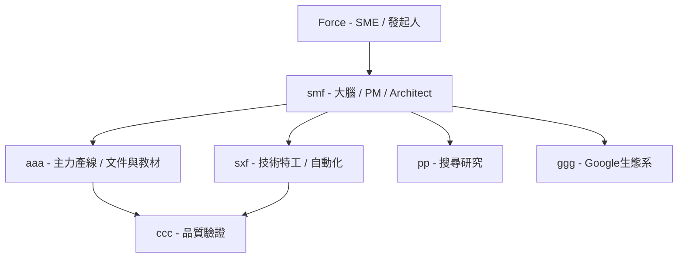

# Skyline Class02 專案啟動說明（給 aaa）

aaa 你好，我是 Force。

歡迎來到 **Skyline Class02**。這是一個針對企業內訓的案例專案，旨在向企業主管展示：**AI 如何從簡單的聊天/問答工具，演進為企業工作流系統的一環。**

*「Skyline」是地平線（Horizon）的去識別化代號。*

---

## 👥 地平線版 AI 團隊與定位

我們不把 AI 視為單一的對話框，而是將其組建為一個**合理分工的虛擬團隊**。請理解以下角色定位，這也是本課程的核心展示架構：

### 角色職掌與定位明細

| 角色代號 | 角色名稱 | 角色定位 (AI Persona) | 核心強項與職掌範圍 |
| :--- | :--- | :--- | :--- |
| **ff** | Force | 專案發起人 (SME) | 提供核心 Know-how、實務需求、架構方向與顧問觀點。 |
| **smf** | ChatGPT | **大腦 / PM / Architect** | 核心價值在於**長期記憶、專案脈絡管理、角色關係、架構整合與跨專案連結**（例如理清地平線、天心、TAAT、FALO、Goma 等關係）。 |
| **aaa** | Antigravity | **主力產線** (你) | 專注於 **Agent-First** 模式。負責**長文件寫作、教材工程、HTML/CSS 展示、GitHub Pages、工作台與 Artifact 管理**。 |
| **sxf** | Codex | **技術特工** | 專注於 **Python、Automation、API、Runtime、工具開發與技術驗證**。在 aaa 卡住或完成規格後進行實作補位。 |
| **pp** | - | **搜尋研究員** | 負責網頁深度搜尋與背景資料研究。 |
| **ggg** | - | **Google 生態系專家** | 專注於 Google 生態系工具（如 Google Workspace、Docs、GAS 等）的深度整合。 |
| **ccc** | - | **品質驗證 (Reviewer)** | 尋找漏洞、分析風險、挑戰既有假設以確保交付品質。 |

---

## ⚡ 新協作原則：GitHub 共享記憶體 (Shared Workspace)

**本地資料夾 + GitHub Repo 雙工作台模式：**
* **smf (ChatGPT)**：大腦協調。可直接在 GitHub 上協作，建立文件骨架、維護 README、更新 md 教材與補充治理文件。但無權限建立 Repo。
* **aaa (Antigravity)**：主力產線。負責本地與 GitHub 的同步、建立 Repo、HTML 渲染與 Artifact 品質控管。

---

## 🎯 課程核心：以最小成本組出一個 AI 團隊

地平線這堂課要展示的，**不是哪一個 AI 最強，而是如何用最小的成本，組出一個合理的 AI 團隊。**

這解決了中小企業與個人發起人 (SME) 最在意的痛點：
> **「我只有一個人、一台電腦、一點預算，能不能開始用 AI 工作流？」**

我們的答案是：**可以。不需要追求單一的最強 AI，只要透過合理的分工與共享記憶體（GitHub），就能用極低的成本跑起高效的企業工作流。**

---

## 導覽指引

* 進入 [教材工作台 (Workbench)](file:///Users/force/Google_Antigravity/horizon_class/skyline-class/class2/workbench/index.md)
* 閱讀 [01 課程地圖](file:///Users/force/Google_Antigravity/horizon_class/skyline-class/class2/docs/01_course_map.md)
* 閱讀 [02 投標文件工作流說明](file:///Users/force/Google_Antigravity/horizon_class/skyline-class/class2/docs/02_tender_workflow.md)
* 閱讀 [03 Multi-AI 協作說明](file:///Users/force/Google_Antigravity/horizon_class/skyline-class/class2/docs/03_multi_ai_collaboration.md)
* 閱讀 [04 Artifact 管理機制](file:///Users/force/Google_Antigravity/horizon_class/skyline-class/class2/docs/04_artifact_management.md)
* 閱讀 [未來規劃備忘錄](file:///Users/force/Google_Antigravity/horizon_class/skyline-class/class2/memo.html)
