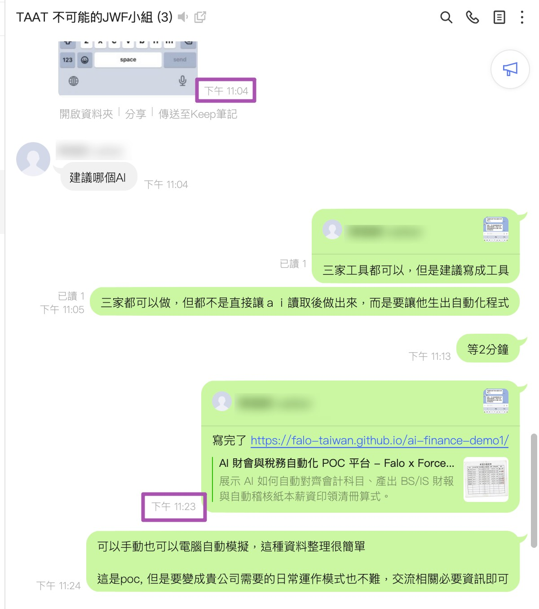
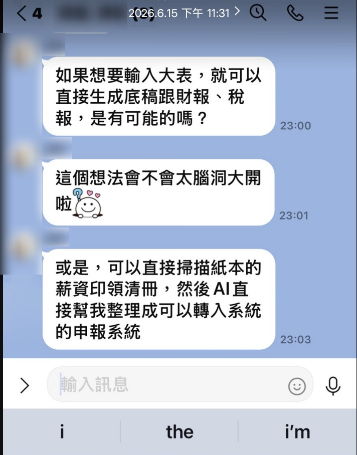
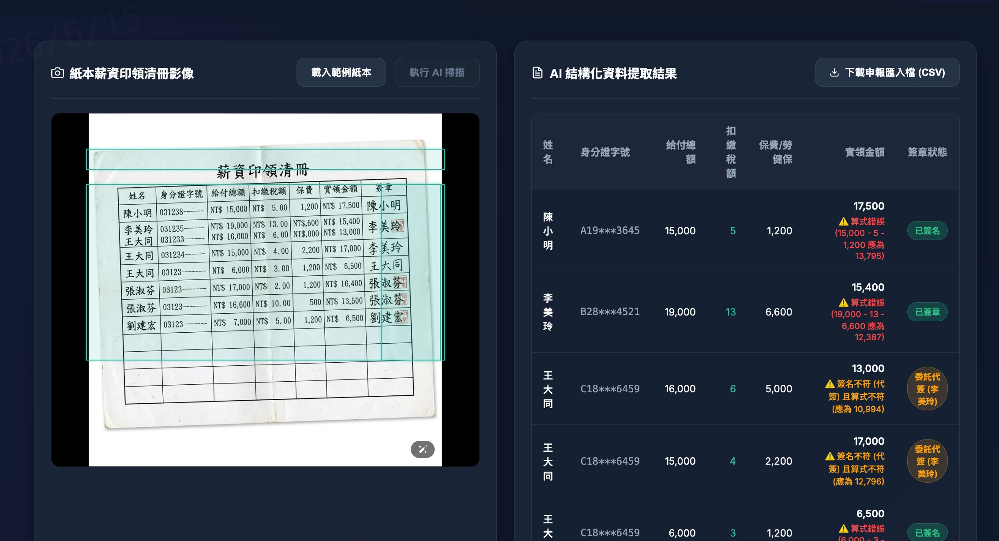

# 📊 AI 財會與稅務自動化專案 (AI Finance POC)

這是一個基於 AI 技術的財會自動化概念驗證（POC）專案。專案具體展示了如何將 AI 結合到會計勾稽與稅務申報的工作流中，以大幅降低人工出錯率並提升底稿核對的效率。

線上 Live Demo 測試平台：**[AI 財會與稅務自動化專案 (Live Demo)](https://falo-taiwan.github.io/ai-finance-demo1/)**

---

## 1. 專案源起與日常工作痛點討論

本專案源自於團隊日常對於「財務底稿與報稅自動化」及「紙本簽名薪資清冊稽核」等痛點的真實討論。討論過程中催生了以 AI 多模態技術解決會計人工登錄漏洞的想法：

---

## 2. 實機運作畫面 (AI 多模態辨識與算式糾錯)

平台主畫面的左側載入了由 AI 模擬生成的薪資印領清冊示範影像，右側展示了 AI 結構化資料提取結果。AI 自動比對出人工計算的實領錯誤，以及防呆檢驗出簽名處的「代簽」異常：

---

## 3. 操作錄影與勾稽示範

示範錄影路徑：[falo_finance_demo.mp4](reference/falo-prompt-manager/docs/falo_finance_demo.mp4)

---

## 4. 核心解決方案與技術特點

* **試算表大表勾稽自動化**：透過 AI 進行科目名稱的「語意對齊」，自動匹配不一致的帳目名稱並自動計算借貸平衡，執行營所稅帳外調整（如交際費超限自動扣除）。
* **多模態紙本 OCR 掃描**：利用多模態 AI 自動識別紙本印領清冊的行列格子，精準抓取「給付總額、扣繳稅額、實領金額」，自動重算公式以指出算式錯誤。
* **簽名比對與防呆防弊**：利用多模態視覺比對同一個人的多次簽章筆跡，若有異常（例如多處簽名筆跡一致疑似代簽）會自動滑出警告日誌，並一鍵匯出符合扣繳申報格式的 CSV 檔。
