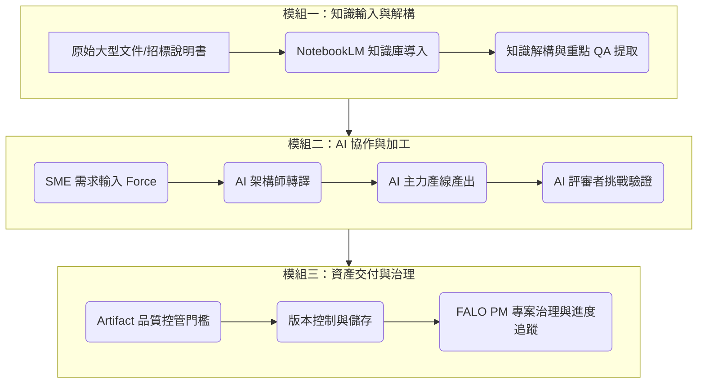

# 01 課程地圖：從單點問答到系統化 AI 工作流

歡迎來到 **Skyline Class02 課程地圖**。本單元將為您梳理本次課程的知識架構、學習路徑，以及從「問答階段」邁向「系統工作流（Skyline）」的思維轉變。

---

## 🚀 核心思維轉變：從問答到系統工作流

在學習 AI 應用時，許多人停留在第一階段。本課程的目的，就是帶領學員跨越這道鴻溝：

| 維度 | 問答階段 (單點問答) | Skyline 階段 (系統工作流) |
| :--- | :--- | :--- |
| **主要模式** | 單一對話框、即問即答、隨機發揮。 | 多角色協作、端到端工作流、可預期的結構化產出。 |
| **知識管理** | 仰賴使用者複製貼上對話紀錄，零散且易遺失。 | 整合 *NotebookLM* 知識庫，產出具備版本控制的 *Artifact*。 |
| **角色定義** | AI 是一個通用的萬用助手。 | AI 具有明確的分工（如架構師、主力產線、技術特工、評審者）。 |
| **企業應用** | 個人效率提升。 | 企業知識資產化、自動化協作、流程合規與治理。 |

---

## 🗺️ Class02 核心知識架構

本課程以「投標文件 (RFP) 協作與管理」為核心案例，設計了以下三個主要模組：

---

## 📖 各單元學習目標與文件對照

| 單元編號 | 教材主題 | 核心學習目標 | 對應教材文件 |
| :--- | :--- | :--- | :--- |
| **01** | **課程地圖** | 建立「系統工作流」心態，掌握整體課程脈絡。 | *本文件* |
| **02** | **投標文件工作流** | 學習如何將複雜、多頁面的招標需求書 (RFP) 拆解成 AI 工作流步驟。 | [02_tender_workflow.html](file:///Users/force/Google_Antigravity/horizon_class/skyline-class/class2/docs/02_tender_workflow.html) |
| **03** | **Multi-AI 協作** | 掌握多個 AI 代理（NotebookLM、主力產線、FALO PM）與虛擬角色之間的分工與資訊流。 | [03_multi_ai_collaboration.html](file:///Users/force/Google_Antigravity/horizon_class/skyline-class/class2/docs/03_multi_ai_collaboration.html) |
| **04** | **Artifact 管理** | 學習企業級的 AI 產出物管理方法，包含命名、版本化與品質檢驗。 | [04_artifact_management.html](file:///Users/force/Google_Antigravity/horizon_class/skyline-class/class2/docs/04_artifact_management.html) |

---

## 🎯 學員學習指引
在閱讀完本課程地圖後，您已對整體框架有了基本認知。接下來，請前往 **[單元 02：投標文件工作流說明](file:///Users/force/Google_Antigravity/horizon_class/skyline-class/class2/docs/02_tender_workflow.html)**，我們將以具體的招標情境，展示 AI 工作流是如何設計與運作的。
