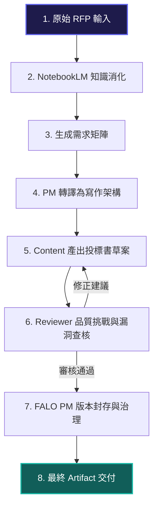

# 02 投標文件工作流：從大型 RFP 到結構化交付

在企業環境中，處理**大型招標文件（RFP, Request for Proposal）**與準備投標書是一項高難度、高壓力的工作。本單元將為您解析傳統企業的痛點，並展示如何利用 AI 工作流將此流程全面升級。

---

## 🛑 企業的真實痛點

當企業面對一個 200 頁的政府或大型企業招標說明書時，通常會面臨以下挑戰：

1. **時間壓力極大**：從招標公告到截止投標通常僅有 14 至 30 天，時間非常緊迫。
2. **閱讀瓶頸**：文件冗長、法律條款複雜，人工閱讀容易遺漏關鍵要求（如必備資格、罰則、交付時程）。
3. **跨部門協作混亂**：技術團隊、財務團隊與法務團隊各自撰寫，缺乏統一的架構與一致的寫作風格。
4. **合規風險高**：只要遺漏一個合規要件，整份投標書就可能在資格審查階段被直接淘汰。

---

## ⚙️ AI 端到端工作流設計 (End-to-End Workflow)

為了解決上述痛點，我們不只是讓 AI 來「寫草稿」，而是設計了一個**端到端的多角色協作工作流**。

### 🔄 工作流圖示 (Workflow Visualization)

---

## 📝 工作流步驟詳解

| 步驟 | 階段名稱 | 負責工具/角色 | 輸入 (Input) | 處理過程 (Process) | 輸出 (Output) |
| :--- | :--- | :--- | :--- | :--- | :--- |
| **1** | **知識導入與消化** | **NotebookLM** | 原始 PDF/Word 招標文件。 | 快速建立索引，並消化合約、技術、法規等跨領域背景知識。 | 知識問答庫與重點摘要。 |
| **2** | **需求矩陣提取** | **PM (大腦/架構師)** | NotebookLM 重點摘要。 | 識別所有「必須符合 (Must-Have)」的合規要件與技術規格要求。 | 招標需求矩陣表 (Requirement Matrix)。 |
| **3** | **教材/草案編寫** | **Content (主力產線)** | 需求矩陣與 SME (Force) 的指導方向。 | 負責結構化 Markdown 的編寫，確保格式規範、表達清晰、切合痛點。 | 投標文件草案 (Draft.md)。 |
| **4** | **品質挑戰與查核** | **Reviewer (品質驗證)** | 投標文件草案與原始 RFP 要求。 | 扮演嚴苛的審查委員，尋找草案中的邏輯漏洞、未滿足的招標要件或潛在合規風險。 | 挑戰報告與修改修正意見。 |
| **5** | **版本與專案治理** | **FALO PM** | 通過審查的草案。 | 對文件進行版本化管理，封存為可交付的企業資產，並追蹤後續維護進度。 | 最終 Artifact (V1.0.md)。 |

---

## 💎 企業主管關心的「商業價值」

透過這套工作流，企業能獲得的不再只是「寫得比較快」，而是：
* **合規率提升至 100%**：透過需求矩陣與 Reviewer 角色的雙重把關，確保無任何招標要件遺漏。
* **準備時間縮短 70%**：AI 自動化提取大綱與起草，讓人類專家 (Force) 能專注在核心商業策略與定價，而非繁瑣的文書作業。
* **資產可傳承**：所有過程產出的需求矩陣、技術架構、審核意見都透過 Artifact 機制留存，成為公司未來的投標範本庫。

---

## 🎯 下一步引導
了解工作流的整體架構後，您可能會好奇：這些 AI 角色在技術與邏輯上是如何互動的？
請前往 **[單元 03：Multi-AI 協作說明](file:///Users/force/Google_Antigravity/horizon_class/skyline-class/class2/docs/03_multi_ai_collaboration.html)**，我們將深入剖析 Class02 的核心主角與協作機制。
