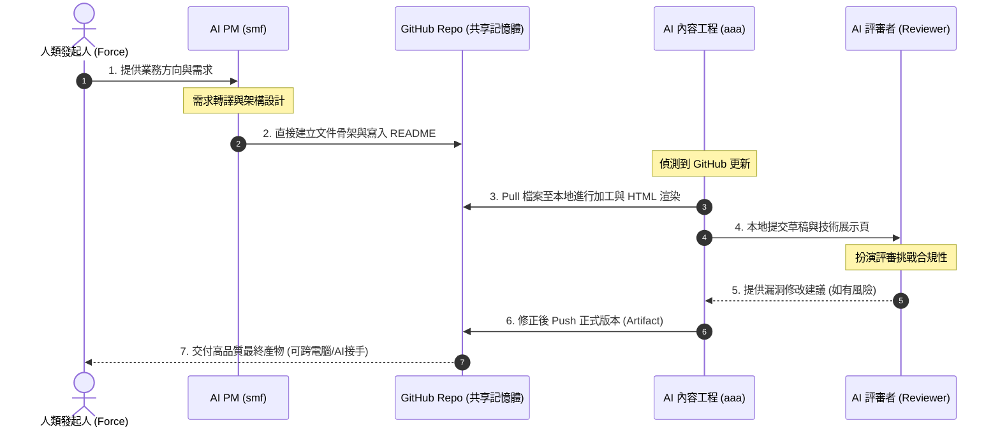

# 03 Multi-AI 協作：打造企業級虛擬團隊與共享工作區

在 Skyline Class02 的世界裡，我們徹底打破「一個人對著一個 AI 視窗發問」的傳統模式。相反地，我們將多個 AI 工具與虛擬角色串接，形成一條高效的**企業級虛擬生產線**。

同時，我們迎來了一個重大的協作里程碑：**將 GitHub 倉庫定位為整個虛擬團隊的「共享記憶體（Shared Workspace）」**。

---

## 🔗 雙軌運行：GitHub 共享記憶體 (Shared Workspace)

GitHub 不僅是傳統的代碼版本控制系統。在 Multi-Agent 協作架構中，它是 **AI 共同工作區、AI 知識交換區、AI 交接區與長期資產保存區**。

```mermaid
graph LR
    subgraph Local[本地工作區]
        AAA_Local[aaa 本地教材工程]
        SXF_Local[sxf 本地開發/Runtime]
    end

    subgraph GitHub[GitHub 共享工作區 (Shared Memory)]
        GH_Repo[(Skyline Repo)]
    end

    subgraph Remote[外部 AI 協作者]
        SMF_Cloud[smf 雲端協作/ChatGPT]
    end

    SMF_Cloud -->|1. 直接修改與 Commit| GH_Repo
    GH_Repo -->|2. Pull 同步到本地| AAA_Local
    AAA_Local -->|3. 本地加工與 Push| GH_Repo
    SXF_Local -->|4. 技術開發與 Push| GH_Repo

    style GH_Repo fill:#1e1b4b,stroke:#6366f1,stroke-width:3px,color:#fff
```

### 雙工作台運作模式
1. **smf (ChatGPT - AI PM / Architect)**：可以直接在 GitHub 上協作，建立文件骨架、維護 README、更新 md 教材與補充治理文件。但 smf 本身**無權限建立 Repo**。
2. **aaa (Antigravity - AI Content Engineer)**：負責本地的專案管理與教材工程。當 smf 完成 GitHub 文件更新後，由 aaa 進行本地與 GitHub 間的同步（Pull / Push），並負責新 Repo 的建立與 Artifact 品質關卡。

---

## 🛠️ Class02 的三大主角工具定位

要完成一項複雜的企業任務（如投標），我們需要不同特性的 AI 工具進行分工：

* **NotebookLM（知識檢索與理解）**：
   * **職責**：知識底座。負責處理並索引數百頁的招標規範與歷史檔案。所有回答皆附帶原始文件的引用出處，確保「事實」的準確性，防堵幻覺。
* **Antigravity（整理、加工與教材化 - aaa）**：
   * **職責**：內容工程師。將 NotebookLM 檢索出的事實與規則，加工整理成結構化 Markdown 文件、HTML 教材與維護共享 Repo。
* **FALO PM（專案追蹤與治理）**：
   * **職責**：專案管理與合規把關。定義並監控任務清單（Task.md），控制 Artifact 的狀態與版本，確保每個步驟的品質都符合企業資產標準。

---

## 👥 虛擬團隊的五大角色互動與資訊流

在「共享記憶體（GitHub Repo）」的機制下，各角色與共享倉庫的互動時序如下：



### 角色職責明細表

* **ff (Force - 人類發起人)**：
  * *「方向引導者」*。不負責撰寫細節，只提供核心 Know-how、經驗、案例需求與方向審查。他是這條生產線的最高決策者。
* **smf (ChatGPT - AI PM / Architect)**：
  * *「流程協調者」*。可直接在 GitHub 上協作，建立文件骨架、維護 README、補充治理文件、更新 md 文件與整理知識庫。
* **sxf (Codex - AI Developer)**：
  * *「技術實作人」*。專注於 Repo 結構、技術 Demo 的實體開發、自動化腳本撰寫與代碼 Push。
* **aaa (Antigravity - AI Content Engineer / 本人)**：
  * *「本地專案管理與教材工程」*。負責建立 Repo、Git 同步操作、HTML 教材工程與 Artifact 管理。
* **ccc (AI Reviewer - 挑戰者)**：
  * *「品質守門人」*。以紅隊思維專門找系統漏洞、合規風險，挑戰既有假設，確保最終產物無懈可擊。

---

## 💡 給企業主管的啟示：AI 共享記憶體的重要性

許多企業在引入 AI 時，只讓員工單打獨鬥，導致知識零碎、無法累積。
Skyline Class02 的新協作原則告訴我們：
> **「透過 GitHub 作為多 AI 共同工作區，我們建立了一個可持續累積、跨 AI、跨電腦接手的『企業共用記憶體』。」**

在這個架構下，即使未來有新的 AI 代理加入，或是需要不同電腦的工程師接手，只要直接 `git pull` 即可無縫獲取所有的前置知識與工作進度。這使得 AI 的產出真正升級為企業可控的「長期數位資產」。
