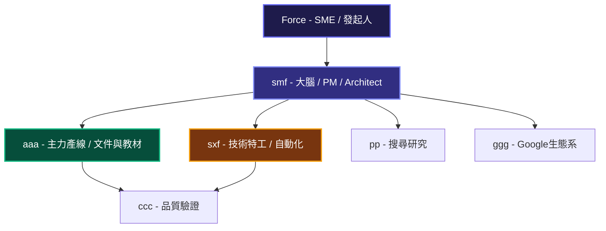
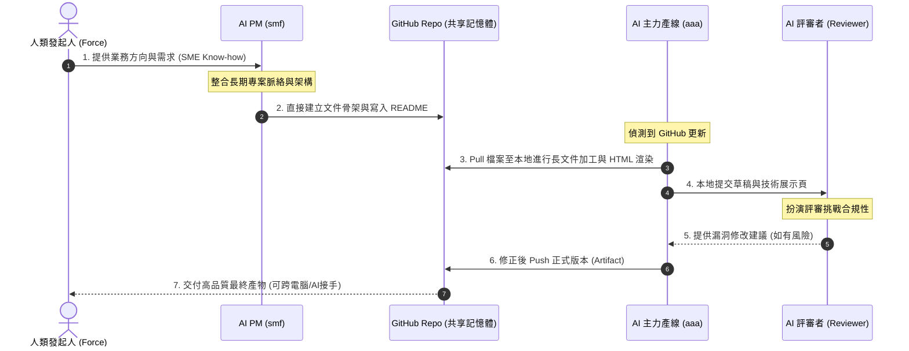

# 03 Multi-AI 協作：打造企業級虛擬團隊與共享工作區

在 Skyline Class02 的世界裡，我們徹底打破「一個人對著一個 AI 視窗發問」的傳統模式。相反地，我們將多個 AI 工具與虛擬角色串接，形成一條高效的**企業級虛擬生產線**。

同時，我們迎來了一個重大的協作里程碑：**將 GitHub 倉庫定位為整個虛擬團隊的「共享記憶體（Shared Workspace）」**。

---

## 💡 課程核心：以最小成本組出一個 AI 團隊

地平線（Horizon / Skyline）這堂課要展示的，**不是哪一個 AI 最強，而是如何用最小的成本，組出一個合理的 AI 團隊。**

這解決了中小企業與個人發起人 (SME) 最在意的痛點：
> **「我只有一個人、一台電腦、一點預算，能不能開始用 AI 運作企業級工作流？」**

我們的答案是：**可以。不需要追求單一的最強 AI，只要透過合理的分工與共享記憶體（GitHub），就能用極低的成本跑起高效的企業工作流。**

---

## 👥 地平線版 AI 虛擬組織架構

我們不把 AI 當成一個聊天框，而是當作各自擁有不同天賦的**團隊成員**。以下是我們設計的虛擬組織架構：



### 1. ff (Force - 人類發起人 / SME)
* **職能**：**SME / 發起人**。
* **主要提供**：核心 Know-how、需求、架構方向、顧問觀點。ff 不需要動手寫大量文件，他是方向的掌舵者。

### 2. smf (ChatGPT - 大腦 / PM / Architect)
* **職能**：**大腦 / 協調者 / 架構師**。
* **核心價值**：**長期記憶、專案脈絡管理、角色關係、架構整合與跨專案連結**。
* **說明**：smf 的核心價值不是寫大量代碼或文件，而是理清與管理跨專案的脈絡（例如理清地平線、天心、TAAT、FALO、Goma、Kerwin 等關係）。

### 3. aaa (Antigravity - 主力產線 / 你本人)
* **職能**：**文件與教材產線 (主力產線)**。
* **核心價值**：Google Antigravity 模型天然偏向 **Agent-First** 模式，最適合處理**長文件輸出、教材工程、HTML 展示、GitHub Pages、工作台引導與 Artifact 治理**。他是整個產線的實體產出發動機。

### 4. sxf (Codex - 技術特工)
* **職能**：**技術特工**。
* **核心價值**：最適合處理 **Python、Automation、API、Runtime、工具開發與技術驗證**。
* **說明**：sxf 不是文件工廠，而是特工。在 aaa 卡住時進行補位，或者在 aaa 完成規格與結構設計後進行技術代碼實作。

### 5. pp (搜尋研究員) 與 ggg (Google 生態系專家)
* **pp** 負責網頁深度搜尋與背景資料整理。
* **ggg** 專注於 Google 生態系工具（如 Google Workspace、Docs、GAS 等）的深度整合。

### 6. ccc (AI Reviewer - 挑戰者)
* **職能**：**品質驗證**。以紅隊思維專門找系統漏洞、合規風險，挑戰既有假設，確保交付無懈可擊。

---

## 🔗 雙軌運行：GitHub 共享記憶體 (Shared Workspace)

這是一個極具意義的專案里程碑：**將 GitHub 倉庫定位為整個虛擬團隊的「共享記憶體（Shared Workspace）」**。

```mermaid
graph LR
    subgraph Local[本地工作區]
        AAA_Local[aaa 本地教材工程]
        SXF_Local[sxf 本地開發/Runtime]
    end

    subgraph GitHub[GitHub 共享工作區 (Shared Memory)]
        GH_Repo[(Skyline Repo)]
    end

    subgraph Remote[外部 AI 協作者]
        SMF_Cloud[smf 雲端協作/ChatGPT]
    end

    SMF_Cloud -->|1. 直接修改與 Commit| GH_Repo
    GH_Repo -->|2. Pull 同步到本地| AAA_Local
    AAA_Local -->|3. 本地加工與 Push| GH_Repo
    SXF_Local -->|4. 技術開發與 Push| GH_Repo

    style GH_Repo fill:#1e1b4b,stroke:#6366f1,stroke-width:3px,color:#fff
```

### 雙工作台運作模式
* **本地資料夾 (Local Folder) + GitHub Repo 雙工作台**。
* **smf (ChatGPT)**：大腦協調。可直接在 GitHub 上協作，建立文件骨架、維護 README、更新 md 教材與補充治理文件。但無權限建立 Repo。
* **aaa (Antigravity)**：主力產線。負責本地與 GitHub 的同步、建立 Repo、HTML 渲染與 Artifact 品質控管。

---

## 👥 虛擬團隊的資訊流與協作時序

在「共享記憶體（GitHub Repo）」的機制下，各角色與共享倉庫的互動時序如下：



---

## 💡 給企業主管的啟示：AI 共享記憶體與分工

許多企業在引入 AI 時，只讓員工單打獨鬥，導致知識零碎、無法累積。
Skyline Class02 的新協作原則告訴我們：
> **「透過合理的 AI 角色分工，配合 GitHub 作為多 AI 共同工作區，我們建立了一個可持續累積、跨 AI、跨電腦接手的『企業共用記憶體』。」**

在這個架構下，即使未來有新的 AI 代理加入，或是需要不同電腦的工程師接手，只要直接 `git pull` 即可無縫獲取所有的前置知識與工作進度。這使得 AI 的產出真正升級為企業可控的「長期數位資產」。
