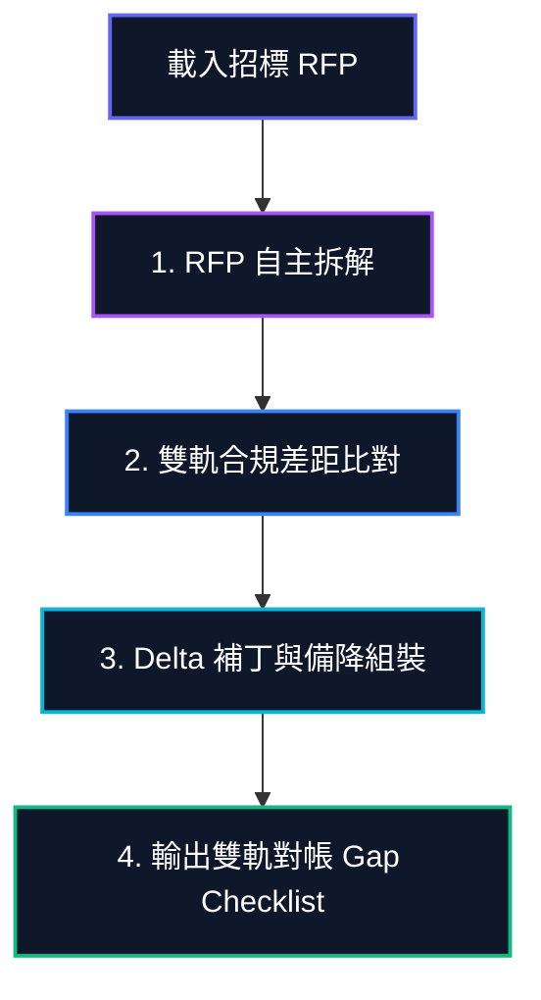

# 👥 單元 03：實戰對帳：智能投標工作流端到端演練 (Tender Workflow & SLA Conflict)

本單元將以一個真實且極具挑戰性的 **「政府智慧文件政務工程標案」** 為背景，展示 Pro 等級 AI Agent 如何自主運行端到端的工作流，解決複雜的技術對帳與管理衝突。

---

## 🏢 實戰情境背景

* **招標對象**：政府政務機關 (200 頁 RFP 需求書)。
* **🌐 外部招標硬性要求 (Client Compliance)**：
  1. 技術承諾：系統故障必須於 **2小時內響應並排除 (2h SLA)**，低於此承諾直接廢標。
  2. 財務資格：必須提供 300 萬元以上之「政府智慧檔案/ERP 專案」歷史實績，且必須附帶客戶簽章的驗收公文。
  3. 團隊資歷：專案經理 (PM) 必須持有有效的 PMP 國際證照。
* **🛡️ 內部治理與成本控制要求 (Corporate Governance)**：
  1. 誠信紅線：絕不能虛構或美化任何缺少物理簽章的驗收公文。
  2. 成本紅線：內部預設技術團隊響應時間為 4h SLA。若要升級為 2h SLA，會產生高額值班加班成本，**必須強制觸發內部成本預警與主管審批**。

---

## 🔄 Agent 一條龍作業流向

面對上述衝突，傳統上需要 PM、財務、法務及技術特工開會數天對帳。而 Agent 團隊則在一條龍工作流中自主完成：

### 1. RFP 自主拆解與提取 (RFP Parser)
Agent 自動閱讀招標文件，無感過濾廢話，精準提取出「2h SLA 響應」、「300 萬實績與公文」、「PM 持有 PMP」三大關鍵硬性廢標條款。

### 2. 雙軌對帳與差距分析 (Gap Audit)
Agent 主動讀取內部資料庫，對比發現三處嚴重衝突：
* **資歷死穴**：預設 PM 志明的 PMP 證照已於 2024 年底過期 (廢標風險)。
* **誠信衝突**：預設的 450 萬「鼎盛專案」因無客戶簽章驗收單，觸發誠信紅線，不能強行使用。
* **SLA 升級警告**：外部要求的 2h SLA 比內部的 4h SLA 響應時間短，會引發成本調撥預警（黃燈）。

### 3. Delta 補丁與備降組裝 (Composition)
Agent 自主產生補丁解決方案：
* **人員備降**：自動替換為證照齊全的 Sophia (林淑芬) 擔任投標 PM。
* **實績替代**：自動排除鼎盛專案，改用 100% 公文齊備的「繁星智慧檔案專案 (350 萬元)」進行防禦（滿足 300 萬門檻）。
* **SLA 成本計算**：自動估算升級至 2h SLA 的人力成本增幅，草擬內部成本調撥同意書，等待主管授權。

---

## 📊 決策中控台：雙軌對帳 Gap Checklist

最終，Agent 將數百頁文件及複雜對帳過程，濃縮為決策者中控台上的**一頁式合規查核表**：

| 對帳項目 | 外部招標要求 (RFP) | 內部防禦狀態 | 合規燈號 | 採取的自動補丁措施 |
| :--- | :--- | :--- | :---: | :--- |
| **SLA 技術響應** | 必須滿足 2h 響應 | 內部為 4h，需要升級 | ⚠️ 黃燈 | 自動計算溢價成本，已產出成本調撥單待簽核。 |
| **歷史專案實績** | 金額 > 300 萬且公文齊全 | 繁星智慧專案 (350 萬，公文完整) | 🟢 綠燈 | 啟動誠信紅線防禦，主動排除無驗收單的鼎盛專案。 |
| **專案經理持證** | 必須持有有效 PMP 證照 | 志明證照過期，Sophia 有效 | 🟢 綠燈 | 自動移轉 PM 資格給備降 PM Sophia 接管。 |

---

> [!TIP]
> 透過這張合規查核表，總經理可以在一分鐘內掌握全局，並授權放行。接下來，在 **[單元 04：決策者視角：真理中心與一鍵收割同步機制](file:///Users/force/Google_Antigravity/horizon_class/skyline-class/class2/docs/04_artifact_management.html)** 中，我們將說明如何將通過核准的黃金知識安全地更新回公司的核心資料庫中。
