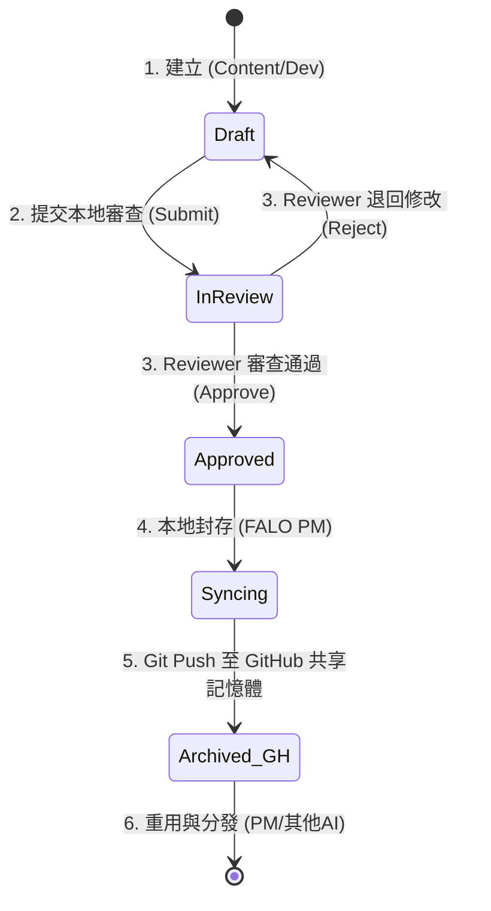

# 04 Artifact 管理機制：將 AI 產出轉化為企業資產

在傳統的 AI 使用情境中，產出的資料往往分散在員工個人的對話歷史紀錄中。這類資料被稱為**「暗資料 (Dark Data)」**——它們不可控、不可被版本管理、更無法被企業共享。

為了解決這個問題，**Skyline Class02** 引入了 **Artifact (產出物/資產) 管理機制**。同時，結合了 **GitHub 共享記憶體 (Shared Workspace)** 機制，本單元將詳細說明如何將 AI 產出進行結構化管理、同步與品質治理。

---

## ❓ 什麼是 Artifact？

在軟體工程與企業工作流中，**Artifact** 指的是「在工作流程中產生、具有高保存價值，且經過驗證的結構化產出物」。
在投標與文件協作情境中，典型的 Artifact 包含：
* **需求矩陣表**（Excel 或 Markdown 格式）
* **投標書特定章節草稿**（Markdown 格式）
* **合規性審查報告**（PDF 或 Markdown 格式）
* **展示前端頁面**（HTML/JS 檔案）
* **工作流架構圖**（Mermaid/SVG 格式）

---

## 🔄 Artifact 的生命週期管理與 Git 同步

為了確保 AI 產出的品質與合規性，每一個 Artifact 都必須經歷以下五個生命週期階段，並藉由 **GitHub 共享記憶體** 進行多 AI / 跨電腦的交付同步：



### 1. 建立 (Creation)
* **執行角色**：AI 執行者（如 Content、Dev）在本地建立，或 PM (大腦/架構師) 直接在 GitHub Repo 建立骨架並拉取（Pull）到本地。
* **規範**：必須使用統一的 Markdown 模板，並在檔案頂部或元數據中標記屬性。

### 2. 元數據標記 (Metadata Definition)
每個 Artifact 檔案頂部都應包含明確的元數據，以便未來系統化索引與查詢：
```yaml
---
artifact_id: ART-2026-TENDER-01
title: 招標需求比對矩陣
version: V1.0.0
author: Content (主力產線)
reviewer: Reviewer (品質驗證)
status: In-Review # [Draft, In-Review, Approved, Archived]
last_updated: 2026-06-13
---
```

### 3. 品質評審關卡 (Review Gate - Reviewer 角色)
這是企業 AI 治理中最關鍵的一步。**未經評審的 Draft 絕不能直接交付或 Commit 至 main 分支。**
* 審查者（Reviewer）會針對合規性、一致性、正確性進行紅隊挑戰。
* 若不合格，退回 Draft 階段由 Content 進行修正；若合格，則變更狀態為 `Approved`。

### 4. 版本控制、歸檔與 GitHub 同步 (Versioning & GH Sync)
* **工具**：FALO PM、Git、GitHub。
* **做法**：對 Approved 的 Artifact 進行語義化版本標記（例如 `V1.0.0`），由 Content 透過 Git `Push` 同步至 **GitHub 遠端倉庫（共享記憶體）**，這能確保：
  1. 外部的 **PM (大腦/架構師)** 或其他 AI 可以直接獲取最新的已審核資產。
  2. 專案能跨電腦、跨人/AI 進行交接，不流失進度。

### 5. 重用與分發 (Reuse & Distribution)
* 歸檔於 GitHub 的 Artifact 會被重新拉取或導入 **NotebookLM**，做為未來其他專案的「黃金範本（Golden Template）」或背景知識，形成知識的正向循環。

---

## 🛡️ 企業 AI 治理 (AI Governance) 核心原則

實施 Artifact 管理與雙工作台同步後，企業可以有效落實以下治理政策：
1. **防堵幻覺風險**：所有交付物均有 Reviewer (品質驗證) 的審核與修改紀錄，並標明知識源引自何處。
2. **追溯權責**：當文件出錯時，藉由 Git 的 Commit History 與元數據，可以輕易追溯是哪一個版本的 Artifact、由哪一個 AI 角色生成、由誰審核通過。
3. **消除知識孤島**：本地與遠端雙軌同步，所有 AI 與人類專家都基於同一個 GitHub 共享記憶體工作，杜絕對話框暗資料。

---

## 🎯 下一步引導
至此，您已完成了 Skyline Class02 教材工作台的所有理論單元學習。
接下來，您可以返回 [教材工作台主控台 (Workbench)](file:///Users/force/Google_Antigravity/horizon_class/skyline-class/class2/workbench/index.html) 進行複習，或是前往 [未來規劃備忘錄](file:///Users/force/Google_Antigravity/horizon_class/skyline-class/class2/memo.html) 查看未來的開發與協作規劃。
