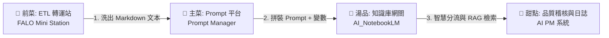
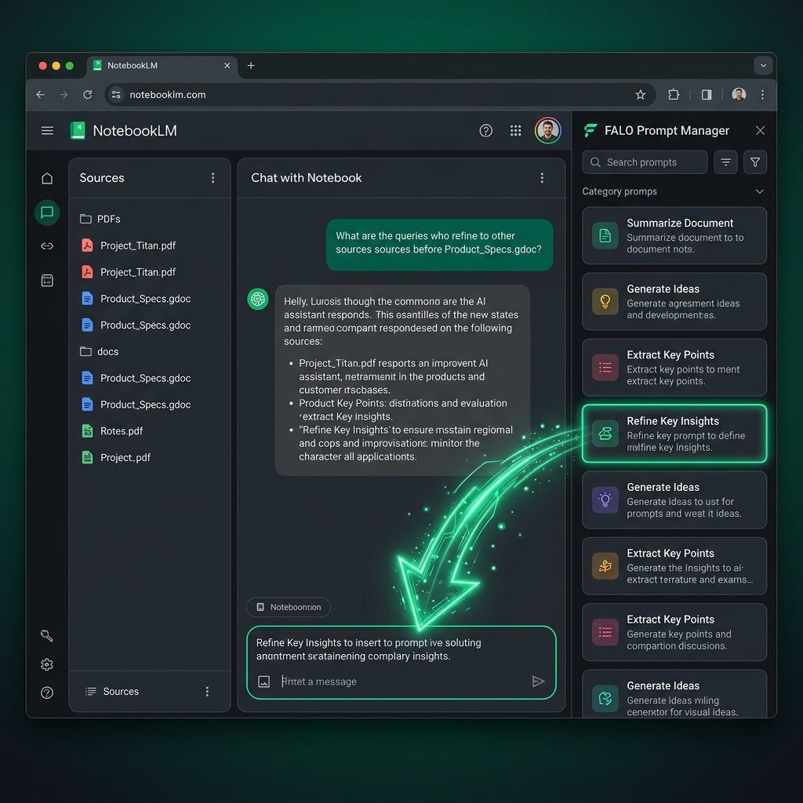

# 🍱 FALO 模型菜組合包範例：企業智能投標工作流

為幫助學員與企業主管（如G總、C董）直觀理解，我們將前述所有獨立模組（ETL、Prompt、RAG、PM）串接，形成一套完整的 **「FALO 模型菜組合包 (Set Meal)」** 實戰範例：

## 🥗 前菜：資料前置清洗與 ETL (FALO Mini Station)
* **功能**：同仁複製混亂的客戶投標需求（RFP），或直接截圖上傳。
* **輸出**：Mini Station 執行輕量級 OCR 與 ETL 清洗，自動過濾雜訊，產出結構乾淨的 Markdown 格式文本。

## 🍲 主菜：指令包裝與變數代入 (FALO Prompt Manager)
* **功能**：調用 Prompt 平台內建的 `[標前需求預判 Checklist]` 範本，自動套入變數（如公司名稱、技術參數）。
* **衛星外掛 (Chrome Extension)**：為了加速日常工作流，我們同時提供了 **FALO Prompt Manager 衛星外掛版 (Chrome Extension)**。該外掛直接承接地端主 Prompt 中心的資料庫（支援一鍵 Live Tab 雙向同步），常駐於瀏覽器側邊欄 (Side Panel)，當同仁開啟 ChatGPT, Gemini, Claude 等 AI 網站時，可在側邊欄填入變數後「一鍵自動填入」對話框，免去手動複製貼上，使指令套用更直覺。
* **外掛與 NotebookLM 整合工作流示意**：
  
* **輸出**：拼裝成上下文完整、語意清晰、免去人工手動複製修改的「高精度 Prompt」，並直接注入 AI 平台對話框中。

## 🍛 湯品：智慧分流與安全檢索 (AI_NotebookLM 網關)
* **功能**：將 Prompt 自動發送至網關後端。網關先向 `Master Router Notebook` 提問解析：「該問哪個書庫？」隨後將問題投遞至目標書庫（如：歷史得標案例庫）進行檢索。
* **輸出**：安全取得經由沙盒保護的標案可行性評估，同仁接觸不到敏感的原始文件。

## 🍨 甜點：日誌合規與進度管控 (AI PM 系統)
* **功能**：網關在執行問答時，自動透過 GAS 將對話內容與 FinOps Token 費用記錄在 Google Sheet 資料庫中，並由 AI PM 自動更新專案追蹤進度與交付成果稽核。
* **輸出**：產出透明、合規的專案進度與成本控管日誌。
