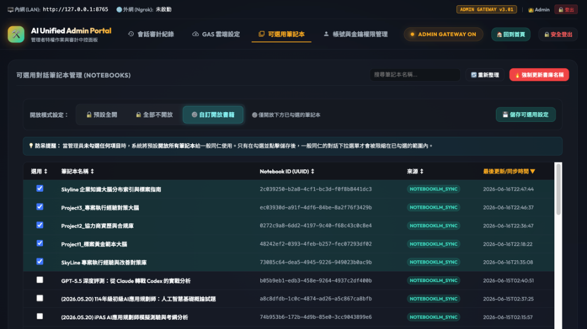

# 📘 NotebookLM 企業級應用與安全治理指南 (Enterprise Application & Governance Guide)

本文件說明如何將 **AI NotebookLM** 導入企業架構，並以 **G總 (Julie)** 提供的 [專案執行經驗與改善對策庫 (pm_experience_responses_raw.csv - 已用 AI 去識別化)](file:///Users/force/Google_Antigravity/horizon_class/skyline-class/class2/pm_experience_responses_raw.csv) 為核心案例，展示如何建立安全、可稽核且具成本效益的「地端真理中心 (SSOT)」資料流。

> 📥 **NotebookLM 專屬企業共享大腦資源包 (NotebookLM Shared Brains Package)**
> 為了協助企業同仁與學員快速建置專屬知識大腦，我們已將去敏後的完整訓練文檔（含標案黃金範本、協力商資歷合規庫、歷史專案經驗等）打包完成。
> 請點此下載：**[notebooklm_shared_brains.zip (NotebookLM 企業大腦資源包)](notebooklm_shared_brains.zip)**，下載後解壓即可直接導入 NotebookLM。

---

## 🧩 0. 關注點分離：查詢網關與管理程式的解耦設計 (Separation of Concerns)

為確保系統在企業內網（如 Windows Node）環境下的高可用性與維護便利性，系統架構將「數據查詢」與「背景管理」進行了解耦分拆：

1. **ai-notebooklm (資料查詢網關 - 輕量對話與日誌)**：
   - 專注於 **「資料共用通道與輪次日誌稽核」**。
   - 其程式碼保持精簡，不運行複雜的檔案同步與帳號排程任務，保障高頻查詢時的系統穩定性。
   - **無須在網關內寫入複雜 Prompt**：在應用場景中，Prompt 自然可以寫入 NotebookLM 中，但除非有高度客製化需求，否則並無必要這樣做。Skyline 具備專屬的模型與 Prompt 管理能力，並且可依需求將此類客製化功能部署至任何應用程式中。此設計旨在讓同仁聚焦於軟體本身最有價值的核心功能（例如知識庫的高精度檢索與文檔比對）。
2. **獨立的 NotebookLM 管理程式 (控制中心 - 排程與同步，選配)**：
   - 負責後台的 Google 帳號池維護、定時更新排程、以及將資料庫/Google Sheet 檔案自動上傳與刷新。
   - 管理程式的維護與升級不會影響前台查詢網關的運作，確保服務不中斷。

* **🖥️ AI Unified Gateway ─ NotebookLM 專區門戶平台介面**：
  

  ##### 📂 已同步至 AI Unified Gateway 的示範筆記本清單 (Synchronized Example Notebooks)
  | 筆記本名稱 (Notebook Name) | Notebook ID (UUID) | 來源 (Source) | 教材與定位說明 (Description) |
  |---|---|---|---|
  | **Skyline 企業知識大腦分布索引與標案指南** | `2c039250-b2a8-4cf1-bc3d-f0f8b8441dc3` | `NOTEBOOKLM_SYNC` | **導航索引大腦**：對應 Section 9，整合三大共享大腦分布索引底稿。 |
  | **Project1_標案黃金範本大腦** | `48242ef2-0393-4feb-b257-fec07293df02` | `NOTEBOOKLM_SYNC` | **大腦一**：標案歷史黃金建議書範本與寫作合規指南 (Section 8)。 |
  | **Project2_協力商資歷與合規庫** | `0272c9a8-6dd2-4197-9c40-f68c43c0c8e4` | `NOTEBOOKLM_SYNC` | **大腦二**：協力商合規、SLA 響應、綠建材與 PMP 降容。 |
  | **Project3_專案執行經驗對策大腦** | `ec03930d-a91f-4df6-84be-8a2f76f3429b` | `NOTEBOOKLM_SYNC` | **大腦三**：專案現場去敏痛點記錄與現場危機排障 SOP。 |
  | **SkyLine 專案執行經驗與改善對策庫** | `73085c64-dea5-4945-9226-949023b0ac9b` | `NOTEBOOKLM_SYNC` | 歷史備份知識庫，作為對照與補充檢索。 |

---

## 🔒 1. 帳號無密碼共用安全機制 (No-Password Shared Access)

企業內訓與日常運作中，若為每位員工單獨採購高級帳號將產生高昂成本；若直接共享主管帳號，則存在密碼與 Cookie 外洩的風險。

* **運作機制**：透過地端 Windows Node 中介網關。
  - 將 **G總** 的高級 Google 帳號授權綁定於後端網關。
  - 同仁登入內網平台後發送查詢，網關會自動代為調用後端服務。
  - **安全效益**：終端使用者無法接觸或檢視 G總 的 Google 帳號憑證，確保企業帳密安全。

---

## 🛡️ 2. 知識沙盒與資料防下載管制 (Secure Knowledge Sandbox)

企業的合約原件、財務報告或內部專案檢討紀錄，皆屬於核心機密資產，需防範被任意複製或下載。

* **運作機制**：AI 唯讀沙盒隔離。
  - 使用者在平台上僅能透過問答獲取「分析後的答案」與「引用文檔的出處與行數（Citations）」。
  - **安全效益**：平台不提供原始 PDF 或 CSV 檔案的下載管道。所有原始機密文件安全鎖定於 Google 沙盒與 G總 的地端資料區中。

---

## 🗺️ 3. 雙階段目錄匹配與智慧路由 (Master Router Navigation)

當企業內部累積了多個學科或部門的 Notebook 知識庫時，同仁往往難以判斷應該向哪一本筆記本提問。

* **運作機制**：兩階段智慧路由檢索。
  - 建立一本主要的 **「Master Router (主腦導航書庫)」**，其中僅儲存各子知識庫的元數據目錄（Metadata Directory）。
  - **解析路徑**：同仁提問時，系統先將問題提交給 Master Router，由其自動判定最符合的子書庫（如：G總 的「專案經驗對策庫」），隨後後端自動切換對接該書庫進行檢索，回傳解答。
  - **管理效益**：提供統一的提問入口，由系統自動分流，簡化使用者操作。

---

## 🎙️ 4. 語音簡報 (Audio Overview) 的管理決策應用

NotebookLM 支援將結構化表格或 PDF 轉化為雙人對談的音訊廣播，適合用於快速瀏覽。

* **實務應用**：G總 提供的試算表記錄了「寵物嘉年華」中音響廠商跳電、長官補頒獎等 36 筆寶貴專案經驗。
* **決策效益**：透過一鍵生成 10 分鐘的 Audio Overview 音訊，**C董** 與主管可在出差或通勤時，快速聽取專案的問題回顧與改善對策，提升資訊吸收效率。

---

## 🔄 5. 人機協同的「一鍵收割」更新閉環

與我們的 **AI PM 平台** 進行資料流整合，建立完整的資料安全發佈迴圈：

1. **Staging 暫存區隔離**：員工日常整理的新增改善建議，先由 AI 協同整理於隔離的 Staging 區。
2. **主管審核**：**G總** 於主控台確認資料無誤後，點擊 `[一鍵收割 (Sync)]`。
3. **資料寫入**：系統自動將新資料寫入 G總 的 [專案執行經驗與改善對策庫 (pm_experience_responses_raw.csv - 已用 AI 去識別化)](file:///Users/force/Google_Antigravity/horizon_class/skyline-class/class2/pm_experience_responses_raw.csv)（SSOT）。
4. **自動更新**：NotebookLM 會自動檢測並刷新該試算表，使全體同仁的知識庫同步更新。

---

## 📊 6. FinOps 升級規劃與多軟體訂閱建議 (FinOps & Subscription Strategy)

為支援上述系統架構的高併發運算與複雜邏輯稽核，並確保企業的資安防護與運作不中斷，我們針對主流 AI 軟體提供以下採購規劃建議（價格以台灣市場為基準）：

### 1. 三大主流 AI 訂閱方案價格參考

| 服務廠商 / 軟體名稱 | 企業/高階方案價格 | 個人/進階方案價格 |
| :--- | :--- | :--- |
| **Google Gemini (AI) 方案** | **Google AI Ultra**: **NT$ 3,300/月** | **Google AI Pro**: **NT$ 650/月** |
| **OpenAI ChatGPT 方案** | **ChatGPT Ultra/Pro**: **USD 100/月** (約台幣 NT$ 3,300) | **ChatGPT Plus**: **USD 20/月** (約台幣 NT$ 650) |
| **Anthropic Claude 方案** | -- | **Claude Pro**: **USD 20/月** (約台幣 NT$ 650) |

---

### 2. 帳號配置策略：雙帳號設計 (Dual-Account Strategy)
在企業實際導入時，強烈建議每個軟體群組至少配置 **2 個帳號**（例如 1 個高階 + 1 個進階，或 2 個同級帳號），主要基於以下兩大考量：

1. **身份別共用與授權管理 (Identity-Based Shared Access)**：
   - 將「主管/決策者角色（擁有高階管理與審核權限，如 Staging 收割、SSOT 寫入）」與「一般員工/網關查詢角色（僅有唯讀查詢與稽核日誌記錄權限）」的授權身份分離。
   - 藉此可在後台網關中，精準限制不同帳號所能存取的知識庫範圍，保護敏感資料。
2. **備份與備員機制 (Redundancy & Failover)**：
   - 儘管高階 Ultra/Pro 方案提供更高的 API 呼叫額度，但在高頻查詢或密集處理招標文件（RFP）時，仍有遭遇臨時 Rate Limit（頻率限制）或使用量封頂的風險。
   - 透過配備 2 個帳號，後端網關可實作自動輪詢與失效切換（Failover）機制，一旦主帳號額度用盡，能瞬間且無感地切換至備用帳號，確保企業運作 24 小時服務不中斷。

---

### 3. Google Ultra 與 DeepThink 升級效益

* **升級 Google Ultra 最低階版本 (NT$ 3,300/月)**：
  - 相較於為所有同仁採購個人版 Pro，購買一個企業/開發者級別的 Google Ultra 帳號作為中央網關，能顯著提升系統的穩定性與使用額度。
  - 此升級可獲得最高的 API 呼叫頻率限制與資源額度，且能更順暢地整合 **Gemini 3.5 Flash** 與 **Antigravity** 工具。
  - **降低使用限制疑慮**：配備 Antigravity 後，系統不再需要擔心呼叫額度用盡的狀況（即便在實務上，系統其實也可以透過切換多個 Pro 帳號來輪替運用，但採用單一 Ultra 帳號作為中央網關在管理與系統穩定度上更具效益）。
  - **奠定未來拓展基礎**：此升級為未來引進 **Gemini Spark (企業版龍蝦)** 專案鋪平了系統與授權上的基礎建設。
* **Gemini 3.1 Pro DeepThink 支援**：
  - 升級後，網關可對接並共用 **Gemini 3.1 Pro DeepThink** 深度推理模型。
  - 在面對高價值標案或複雜合約時，可由 DeepThink 進行深度的思維鏈推演，精準審查招標書（RFP）中跨章節的 SLA 條款衝突，將風險降至最低。

---

### 4. ChatGPT Ultra/Pro (USD 100/月) 訂閱考量與投標場景應用

企業在評估引進 ChatGPT 方案時（包含相當於 Google Ultra 最低階定位的 ChatGPT Ultra/Pro USD 100/月，以及進階版 ChatGPT Plus USD 20/月），除了高額度的對話與代碼撰寫能力之外，最核心的考量還在於其具備的**畫圖功能**與**做簡報功能**。這兩大功能對於開發及使用**投標相關軟體**的企業而言至關重要，具體應用於以下場景：

* **畫圖功能與架構示意圖生成 (Image Generation & Drawing)**：
  - 在開發或撰寫投標計畫書（RFP）時，通常需要附帶大量的系統架構圖、軟硬體配置示意圖、業務流程圖或網路拓撲圖。
  - 透過 ChatGPT 的繪圖與視覺化設計能力，能快速生成專業且精準的概念示意圖，為投標書提供直觀的視覺輔助，顯著提升標案文件的專業感與說服力。
* **做簡報功能與大綱生成 (Presentation/Slide Generation)**：
  - 政府標案與大型合約審查在通過初審後，均要求進行現場簡報與評審答詢。
  - 利用高額度的簡報結構分析與內容提煉能力，系統可流暢執行投標重點提煉，並自動生成格式精美的簡報大綱與投影片結構，大幅加速投標簡報的製作與評審答辯的準備流程。這對於開發及使用投標相關軟體的企業在加速提案週期上是不可或缺的競爭優勢。

---

## ⚖️ 7. NotebookLM 與主流大型語言模型方案之比較 (Tool Comparison)

企業在建置內部 AI 輔助系統時，常面臨工具選型的考量。以下為 NotebookLM 與現行主流方案的優劣勢對比分析：

### 1. 方案特性對比

| 特性 / 維度 | AI NotebookLM 方案 | Gem (Gemini) / Gem_plus | ChatGPT MyGPTs |
| :--- | :--- | :--- | :--- |
| **核心優勢** | 1. **精準文檔定位 (Grounding & Citations)**：回覆均附帶原始文檔的出處與具體行數，極不易產生幻覺。<br>2. **唯讀知識沙盒**：防止敏感原始文件被下載洩漏。<br>3. **零代碼/免提示詞優化 (Zero-Prompt)**：免除繁雜的 Prompt 調整與工程建置。 | 適合日常通用型對話，對長文本有較好的理解力，但對特定文件庫的檢索缺乏原生的嚴謹引用比對機制。 | 模型推理能力較強（在複雜邏輯上表現優異），且可上傳知識庫文件，但對非結構化資料的檢索精準度與防洩漏沙盒機制較弱。 |
| **定位與應用建議** | 適合用於**需要嚴格依據特定文件回答（如標案經驗、規範手冊）的場景**。讓同仁專注於工具的核心高價值功能，而不需要花費精力在複雜的程式同步與 Prompt 工程上。 | 適合做為一般同仁的日常助理，或進行概略性的長文本分析。 | 適用於需要複雜邏輯推理、編寫程式碼或進行高度客製化 Prompt 流程的進階應用場景。 |

### 2. Skyline 實務升級建議
* **現狀與調整**：Skyline 目前內部採用 Gem。先前團隊曾評估改用模型推理能力較強的 **ChatGPT MyGPTs**。
* **整合策略**：在實務落地時，建議將兩者結合——一般通用型、高推理需求的任務可導流至 MyGPTs 或 DeepThink 等高階模型；而針對「專案經驗對策」、「合約合規比對」等**需要絕對嚴格參照特定知識庫、要求精準出處且要防範原始資料外洩的場景**，則應專注使用 **NotebookLM**。如此可讓技術焦點專注在該工具最有價值的核心功能本身，避免在各個 APP 中重複進行無謂的 RAG 與 Prompt 客製化重造輪子。

---

## 💡 8. NotebookLM 共享大腦黃金 Prompt 範本庫 (Shared Brains Prompts Library)

為了讓同仁與學員在導入這三本「企業共享大腦」時能即裝即用，以下設計了多組實務高價值、符合人機協同心智的黃金 Prompt 範本，可直接複製並貼入 NotebookLM 中提問：

### 🧠 大腦一：Skyline_Bidding_Golden_Templates (標案黃金範本大腦)

#### 📝 場景一：服務建議書架構與大綱生成 (Bid Outline Generation)
* **設計目的**：利用歷史黃金建議書範本，為一個全新的展覽投標案起草服務建議書的技術大綱與章節佈局。
* **推薦 Prompt 範本**：
  ```text
  你現在是Skyline (Skyline) 智慧投標顧問。我想針對一個全新的「2026年台中電競嘉年華 (預算 300 萬元)」標案起草服務建議書的技術大綱與章節架構。
  請參閱知識庫中的《02_2026_台南玩具博覽會_黃金建議書範本_Sophia.md》與《03_投標建議書寫作合規指南.md》，分析其黃金寫作框架。
  輸出要求：
  1. 提供完整的建議書大綱章節（包含一級與二級目錄）。
  2. 指出在「團隊經歷」與「技術方案」中，必須包含哪些關鍵要素以符合合規指標。
  3. 在大綱中標註「人類審查點 (HITL)」的建議位置，以防範合規與財務風險。
  ```

#### 📝 場景二：草稿編修與合規寫作審查 (Compliance Review & Refinement)
* **設計目的**：將同仁撰寫的草稿段落，依照合規寫作指南進行語意修改並標記人類審查點。
* **推薦 Prompt 範本**：
  ```text
  你現在是Skyline (Skyline) 標案合規稽核專家。請閱讀知識庫中的《03_投標建議書寫作合規指南.md》。
  我寫了以下建議書草稿段落：「本專案預計委託外協廠商名音負責現場音響與燈光控台，名音承諾於 4 小時內提供現場故障排障服務。」
  請依據合規寫作指南進行審查：
  1. 該段落是否符合合規寫作規範？有何潛在的廢標風險？
  2. 請幫我重寫該段落，使其語意更專業，並在適當位置自動插入 `[人類審查點: 確證變更已獲主管批准]` 或適當的稽核標籤，以防範 SLA 違規。
  ```

---

### 🧠 大腦二：Skyline_Vendor_Compliance_Catalog (協力商資歷與合規庫)

#### 📝 場景一：外協團隊拼裝與合規篩選 (Vendor Selection & Compliance Audit)
* **設計目的**：輸入全新標案的 RFP 限制後，自動篩選出完全合規的外協廠商，並拼裝最優投標團隊組合。
* **推薦 Prompt 範本**：
  ```text
  你現在是Skyline (Skyline) 採購合規經理。我們準備投標一個全新的展會，RFP 硬性規定：「協力商類似案件之單一合約實績金額須達 300 萬以上，且現場故障響應 SLA 須小於或等於 2 小時」。
  請參閱知識庫《01_協力廠商合規矩陣與評估表.md》與《03_專案經理證照規範與備降機制.md》：
  1. 篩選出哪幾家協力商符合「單案實績 300 萬以上」的合規門檻？
  2. 在符合門檻的廠商中，他們的 SLA 響應時間分別是多少？是否符合 2 小時限制？如果不符，有何升級或調整方案？
  3. 請為我推薦最優的協力商組合，並列出推薦的具體數據依據（實績金額、SLA 承諾、合作評分狀態）。
  ```

#### 📝 場景二：綠色建材佔比與環保加分試算 (Green Material Calculation)
* **設計目的**：根據綠色建材指南，試算木作搭建工程以爭取技術標的額分評審加分。
* **推薦 Prompt 範本**：
  ```text
  你現在是Skyline (Skyline) 綠建材評估專家。我想針對本次搭建工程進行綠建材佔比與加分試算。
  請參閱《02_綠色環保建材認證與計算標準.md》，找出大同空間工程的綠色建材認證資料。
  1. 大同空間工程擁有哪項綠建材認證？其宣告的環保材料比例是多少？
  2. 請寫出綠色建材百分比的計算公式，並說明如何利用大同的數據在建議書中呈現，以爭取大於 30% 以上的環保加分。
  ```

---

### 🧠 大腦三：Skyline_Corporate_PM_Lessons_Learned (專案執行經驗對策大腦)

#### 📝 場景一：現場突發危機排障與歷史經驗對齊 (Emergency On-Site Troubleshooting)
* **設計目的**：在活動現場發生突發事件（如跳電、觀眾絆倒）時，快速查找歷史實績與 SOP 進行應急處置。
* **推薦 Prompt 範本**：
  ```text
  你現在是Skyline (Skyline) 展會現場安全指揮官。目前在博覽會現場發生了「配電箱超載臨時跳電，且現場有觀眾在混亂中被電線絆倒輕微擦傷」的緊急狀況！
  請立即檢索《02_活動現場突發狀況緊急處理手冊.md》與《01_台西市寵物嘉年華_專案執行經驗與改善對策彙整.md》中的歷史教訓：
  1. 提供現場跳電排障的 SOP 處理步驟（包含與機電組協調、備用發電機切換）。
  2. 提供受傷觀眾應急處置與現場紀錄流程（包含醫護站聯絡、主管匯報要點）。
  3. 根據寵物嘉年華的歷史教訓，指出我們在現場佈線與電力規劃上犯過什麼錯誤，此時該如何立刻進行現場補救？
  ```

#### 📝 場景二：歷史 PM 回報歸納與年度防坑清單 (Lessons Learned Summary)
* **設計目的**：通讀 36 筆歷史 PM 回報紀錄，歸納常犯錯誤並提煉改善對策，供新進同仁培訓參考。
* **推薦 Prompt 範本**：
  ```text
  你現在是Skyline (Skyline) 企業品質保證 (QA) 總監。我們即將帶領新進 PM 團隊執行年度展會。
  請通讀《01_台西市寵物嘉年華_專案執行經驗與改善對策彙整.md》中所有 PM 的回報紀錄，歸納整理：
  1. 統計出最常發生的前 3 大類別問題（例如：電力載量、動線設計、協力商遲到等）。
  2. 對於每一類常犯錯誤，從歷史檔案中提取出最有效的「改善對策」。
  3. 為新進 PM 製作一份條列式的「展會執行防坑檢核表 (Lessons Learned Checklist)」。
  ```

---

## 💡 9. Skyline 共享大腦導覽與知識底稿 (Index Brain Guide)

為了方便同仁以自然語言隨時查詢「某個工作任務應該使用哪一本大腦專案」，我們特別設計了這本**「導航索引大腦」**。
請在 NotebookLM 中建立一個新專案，並拷貝下方知識底稿（以「貼上文字」方式上傳為該專案的知識源）：

### 📂 知識底稿 Markdown 原始碼 (SSOT Catalog)
同仁可複製以下內容，直接作為索引大腦的資料來源：

```markdown
# 🧭 Skyline 企業共享大腦目錄清冊與知識分布索引 (SSOT Catalog)

本文件為 Skyline 企業內部 NotebookLM 知識大腦的分布指南，詳細記錄各共享大腦的檔案清冊與可解答之關鍵問題範疇。

---

## 🧠 大腦一：標案黃金範本大腦 (Skyline_Bidding_Golden_Templates)
*   **大腦定位**：提供標案寫作大綱、技術方案架構、寫作合規指標、SLA 違規與人類審查點 (HITL) 置放位置。
*   **內含檔案**：
    1. `01_2023_高雄動漫節_技術建議書_Scrubbed.md`
    2. `02_2026_台南玩具博覽會_黃金建議書範本_Sophia.md`
    3. `03_投標建議書寫作合規指南.md`
*   **可解答之關鍵主題與問題範圍**：建議書技術大綱、投標書章節架構、寫作合規指標、SLA 違規補償金、人類審查點 (HITL) 建議位置。

---

## 🧠 大腦二：協力商資歷與合規庫 (Skyline_Vendor_Compliance_Catalog)
*   **大腦定位**：提供合格協力商名單、單一實績金額評審、廠商 SLA 響應時間、綠建材試算百分比公式與 PM 備用降容機制。
*   **內含檔案**：
    1. `01_協力廠商合規矩陣與評估表.md`
    2. `02_綠色環保建材認證與計算標準.md`
    3. `03_專案經理證照規範與備降機制.md`
*   **可解答之關鍵主題與問題範圍**：合格協力商篩選、協力商單一實績金額、廠商 SLA 響應時間、SLA 抵達時間、大同空間工程實績、綠建材百分比計算公式、PMP 證照效期、PM 備降/降容方案。

---

## 🧠 大腦三：專案執行經驗大腦 (去敏版) (Skyline_Corporate_PM_Lessons_Learned)
*   **大腦定位**：提供歷史去敏 PM 痛點記錄（36 筆）、活動現場危機處理 SOP。
*   **內含檔案**：
    1. `01_台西市寵物嘉年華_專案經驗與改善對策.md`
    2. `02_活動現場突發狀況緊急處理手冊.md`
*   **可解答之關鍵主題與問題範圍**：活動現場跳電排障步驟、配電箱超載、觀眾擦傷/跌倒應急處置、人員中暑處置、攤位招牌號碼、對外文宣發布與變更獎品規格問題、廠商發包檔期漏洞、PM 防坑檢核表 (Lessons Learned)。
```

### 💬 導航大腦推薦提示詞 (Prompts)

建置完成後，同仁可複製以下提示詞（Prompts）向導航大腦進行諮詢，即可智慧引導您使用最合適的大腦：

*   **提示詞一：工作痛點實務導航 (Scenario Router)**：
    ```text
    你現在是 Skyline 企業大腦導航助手。我目前在工作上面臨以下具體痛點：【在此輸入您的痛點，例如：活動現場突然跳電了，有觀眾跌倒受傷】。請檢索《Skyline 企業共享大腦目錄清冊與知識分布索引》，為我提供以下引導：
    1. 我應該開啟並使用哪一本 NotebookLM 共享大腦專案？
    2. 該大腦專案中，哪一個檔案包含了解決此痛點的答案或 SOP？
    3. 請為我列出我可以在該大腦專案中提問的推薦關鍵字。
    ```

*   **提示詞二：黃金知識分布定位 (Knowledge Locator)**：
    ```text
    你現在是 Skyline 知識庫治理專家。請幫我定位以下業務知識分別储存在哪一本大腦專案、以及具體的檔案名稱是什麼：
    A. 協力廠商的實績與 SLA 響應時間
    B. 寫作投標書時，SLA 故障排障時間的合規限制與 HITL 語法
    C. 專案經理 (PM) 證照過期時的降容備用機制
    ```
