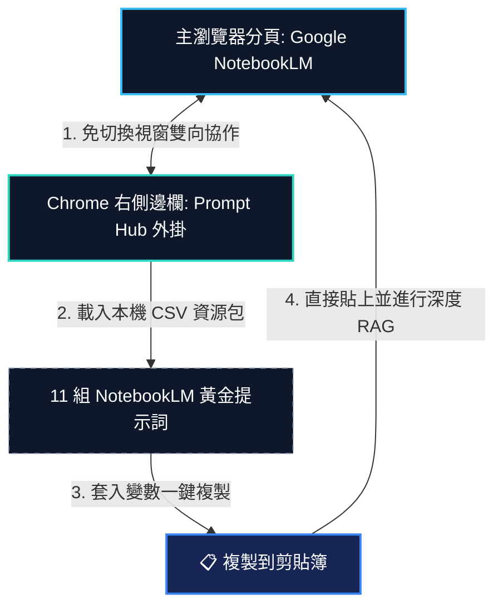

# 💬 Skyline Prompt Hub (Prompt Manager PWA) & 衛星外掛

在組織導入 AI 時，提示詞不應只散落在個人的對話紀錄中，而應被視為可管理、可版本化與快速套用的**「指令資產層」**。**Prompt Hub (Prompt Manager PWA)** 與其 **Chrome 衛星外掛**，正是為了解決此痛點而生。

---

## 💡 Prompt Hub 本地主程式與 Chrome 衛星城市定位

本系統採取「中心與衛星」的兩級架構，提供流暢的指令管理體驗：

*   **地端主 Prompt 平台 (PWA / packages/local-html)**：
    獨立運行的本地 PWA 工具，定位為企業內部的「指令研發中心」。支援 SOP 範本設計、OCR 檔案掃描萃取、標籤管理、變數代入即時預覽與離線 JSON/CSV 安全備份。
*   **Chrome 衛星側邊欄外掛 (packages/chrome-extension)**：
    常駐於瀏覽器側邊欄 (Side Panel) 的衛星工具。透過安全的身分互認標籤，它能與開啟中的地端 PWA 網頁進行 **Live Tab 雙向同步連線**（免匯出檔案即可即時抓取最新卡片），並在 ChatGPT、Gemini、Claude 等平台自動填入對話框。

---

## 🌐 falo-taiwan 官方體驗與 Codebase 資源

本專案已完全開源並部署，同仁與學員可直接點擊下方連結使用或參閱程式碼：

*   👉 **線上 PWA 體驗入口**：[https://falo-taiwan.github.io/prompt-demo/](https://falo-taiwan.github.io/prompt-demo/) (一鍵加入主畫面)
*   👉 **GitHub 專案原始碼**：[https://github.com/falo-taiwan/prompt-demo](https://github.com/falo-taiwan/prompt-demo) (包含 Extension 原始碼)
*   💾 **下載 NotebookLM 黃金 Prompt 資源包 (CSV)**：[notebooklm_shared_brains_prompts.csv](notebooklm_shared_brains_prompts.csv) (相容 Prompt Hub，含 11 組大腦範本)

---

## 🤝 與 Google NotebookLM 的實務搭配運用

透過 Chrome 衛星側邊欄外掛的輔助，同仁在操作 Google NotebookLM 時，可享受雙視窗無縫操作極速對答工作流：

**協同優勢**：學員不需手動去講義中尋找 Prompt 並用滑鼠圈選，只需將外掛固定於瀏覽器右側。在左側操作 NotebookLM 的同時，右側選中卡片、輸入標案參數或廠商名稱，點選複製後隨即在左側貼上。這在需要高頻核對綠建材、SLA 風險、歷史 PM 缺失時，能省下大量的操作時間。

---

## 🛠️ 快速匯入步驟
1. 下載上方的 `notebooklm_shared_brains_prompts.csv` 資源包。
2. 開啟您的 Prompt Hub (PWA)。
3. 點擊右上角 **「⚙️ 管理」** 面板，選擇 **「📥 匯入 CSV」** 並選取該 CSV 檔案。
4. 匯入完成後，側邊欄會即時渲染出 `1. 標案黃金範本大腦`、`2. 協力商資歷與合規庫`、`3. 專案執行經驗對策大腦`、`a. 索引`、`b. Qa` 五個新分組，共 11 組黃金範本！
