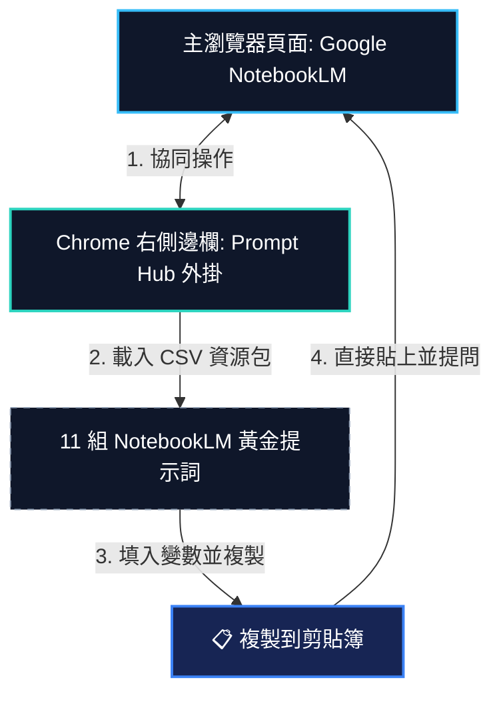

# 💬 Skyline Prompt Hub 導入指引 (PWA + Chrome Extension)

為了幫助同仁與學員快速運用我們精心編寫的 NotebookLM 企業共享大腦黃金 Prompt，我們將這套指令集編譯為完全相容於本機 **Prompt Hub (Prompt Manager PWA)** 的導入資源包。搭配 **Chrome 衛星外掛側邊欄 (Side Panel)**，即可在操作 NotebookLM 時實現一鍵複製貼上的高效率極速工作流！

---

## 🛰️ 協同工作流示意

免切換分頁，利用 Chrome 側邊欄 (Side Panel) 常駐 Prompt Hub 一鍵複製指令至 NotebookLM 分頁：

---

## 📥 下載 NotebookLM 黃金 Prompt 資源包

本資源包包含標案黃金範本、外協合規、經驗對策以及導航大腦共 11 組高價值 Prompt 指令，相容於 Prompt Hub CSV 規格：

*   **[💾 下載提示詞資源包 (CSV)](notebooklm_shared_brains_prompts.csv)**

---

## 🛠️ 快速導入與使用步驟

1.  **Step 1: 開啟本地 Prompt Hub 主程式**
    開啟瀏覽器並載入本機部署的 **Prompt Hub (Prompt Manager PWA)** 門戶首頁。
2.  **Step 2: 匯入 CSV 提示詞資源包**
    點選網頁右上角 **「⚙️ 管理」** 按鈕展開側邊面板，點擊 **「📥 匯入 CSV」**，並選擇剛剛下載的 `notebooklm_shared_brains_prompts.csv` 檔案。匯入成功後，介面會立刻載入四大專屬分類。
3.  **Step 3: 搭配 Chrome 衛星外掛側邊欄**
    在 Chrome 中打開我們的 **Prompt Manager 衛星外掛**，並開啟 **側邊欄 (Side Panel)模式**，將外掛固定於瀏覽器右側。
4.  **Step 4: 極速調用與 NotebookLM 對答**
    在左側主分頁開啟 Google NotebookLM 專案。當需要對大腦提問時，在右側外掛面板直接代入變數值（如標案預算、協力商名稱），點擊 **「📋 複製提示詞」**，隨後貼上至左側對話框即可提問！

---

## 💎 導入效益與優勢

*   **無縫協作**：免除在講義網頁、文字檔與 NotebookLM 視窗之間繁瑣的切換。
*   **資產化管理**：在 PWA 中可隨時對黃金 Prompt 進行版本微調、擴充或備份，讓提示詞成為企業共享資產。
*   **變數化操作**：透過外掛的變數輸入框，不需在文字中手動尋找並替換標記，大幅降低打錯字或漏改欄位的機率。
