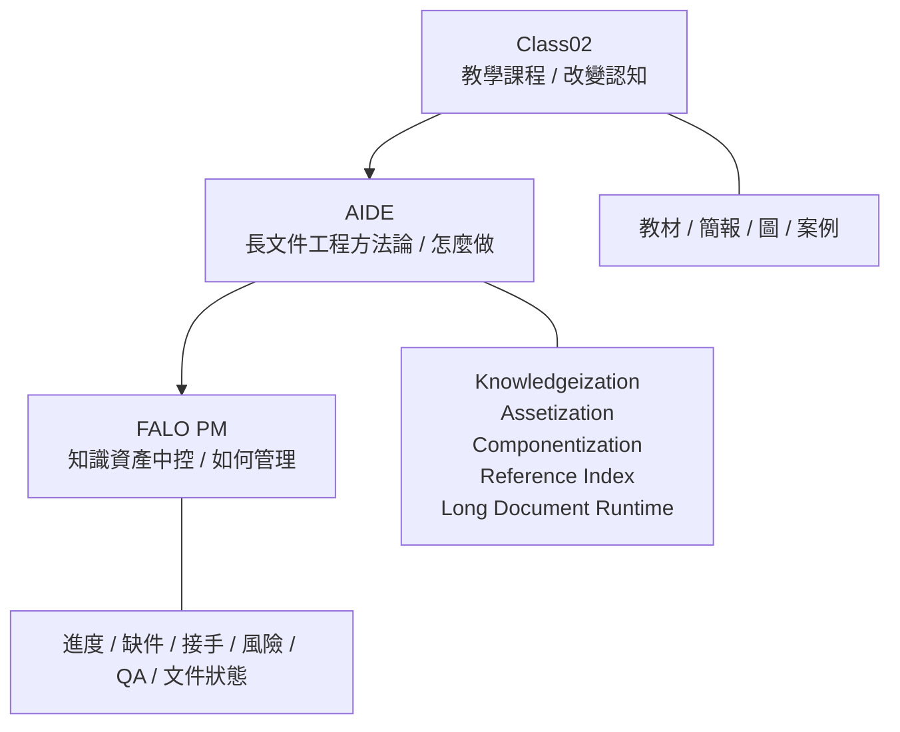

# Class02 課程設計稿：Antigravity + AIDE 升級招標書作業

> AI / aaa 工作母稿  
> 目的：先對齊 Class02 的主軸、邊界、3 小時教學流程與 aaa 開工任務。  
> 狀態：設計對齊稿 v0.1，尚未進入完整教材與產品化。

---

## 1. 北極星

Class02 不是工具課。

不是 NotebookLM 教學課。  
不是 Antigravity 操作課。  
不是 FALO PM 產品課。

Class02 的真正主題是：

> 從過去累積到未來價值  
> 企業知識資產化與 AI 應用實務

本次更精準的落點是：

> 教星河用 Antigravity + AIDE 方法論，升級既有招標書作業流程。

核心判斷：

星河已經會用 Google AI 生文章，也會基本使用 NotebookLM。  
真正缺口不是「不會 AI」，而是：

> 會生成內容，但還沒有把 AI 放進核心工作流。

而星河的核心工作事項之一，是幾百頁的招標書。因此 Class02 應該聚焦在：

> 幾百頁招標書不是文章問題，而是長文件工程問題。

---

## 2. 目標學員狀態

主要學員：

- Grace，女性，總經理角色
- 可能增加一位董事長

已知狀態：

- 星河員工已使用 Google AI 生態系約半年
- 基礎 NotebookLM 使用不是零
- 能用 AI 產生文章
- 但仍以傳統方式處理核心作業
- 對 AI 導入成本投入與產出效益，感知尚未深刻
- 對 AI 工作流與長文件工程的理解仍有限

因此 Class02 不應太淺，也不應再大量講抽象觀念。

教學策略：

> 先示範，再直接教怎麼用、怎麼做。  
> 觀念只作為操作旁白，不再作為主菜。

---

## 3. 三層邊界



### Layer 1：Class02

本質：教學課程  
目的：改變認知，讓高階主管理解 AI 如何升級核心作業  
形式：教材、簡報、圖、案例、實作示範  

Class02 只負責說清楚：

- 為什麼既有資料還沒有變成知識資產
- 為什麼招標書需要工程化
- 為什麼 Antigravity 適合升級長文件作業
- 為什麼最後會自然走向 FALO PM

### Layer 2：AIDE

本質：長文件工程方法論  
目的：說明怎麼做  
形式：流程、模板、檢查清單、方法論  

AIDE 包含：

- Digitization / OCR Entry：把掃描版、紙本或影像型歷史招標文件轉成可搜尋、可引用文字
- Knowledgeization：把招標資料整理成可理解素材
- Assetization：判斷哪些內容可重用、可引用
- Componentization：拆成公司簡介、實績、方法、附件、資格文件等元件
- Reference Index：建立需求條文與文件來源索引
- Long Document Runtime：用 Antigravity 協助組裝、檢查、修正

### 補充定位：OCR 是歷史招標文件數位化入口

OCR 要放入 Class02，但定位要守住邊界。

此處的 OCR 不是 ERP 系統整合，也不是發票、庫存、會計資料的流程自動化。

Class02 的 OCR 指的是：

> 把過去紙本、掃描 PDF、影像型 PDF 的歷史招標文件，轉成 AI 可以搜尋、引用、拆解與重用的數位文字資產。

因此 OCR 在本課程中的角色是：

```text
紙本 / 掃描版歷史招標文件
↓
OCR 轉文字
↓
檔名整理與去重
↓
Knowledgeization
↓
Assetization
↓
Antigravity 長文件工程
```

講師要避免把 OCR 說成另一個大系統專案。  
它只是讓「過去存在但不可利用」的歷史招標文件，進入知識資產化流程的第一道門。

### Layer 3：FALO PM

本質：知識資產中控  
目的：管理流程、狀態、風險與接手  
形式：中控清單、狀態視圖、風險與缺件追蹤  

FALO PM 目前不要定位為 PM 軟體。  
它不是 Jira、ClickUp、Asana。

它比較接近：

> Knowledge Asset Control Center  
> 知識資產中控中心

---

## 4. Class02 3 小時設計

### 課程比例

| 區塊 | 比例 | 說明 |
|---|---:|---|
| Antigravity 實作與示範 | 60% | 主軸，讓Grace看到核心作業如何升級 |
| AI 導入 ROI / 成本產出感 | 20% | 讓主管理解為何值得投入 Pro 以上帳號與系統化 |
| NotebookLM 串場示範 | 10% | 只作為企業知識大腦示範，不教入門 |
| FALO PM 誘導理解 | 10% | 說明為什麼最後需要知識資產中控 |

---

### 0:00 - 0:15｜開場：從 AI 寫文章到 AI 做標案工程

教學目標：

讓學員理解，會用 Google AI 生文章不等於會升級作業流程。

核心對比：

```text
一般用法：叫 AI 幫我寫一段文章
進階用法：讓 AI 協助處理一整份長文件工作流
```

核心句：

> 幾百頁招標書不是文章問題，而是工程問題。

講法提醒：

- 不要重新教 NotebookLM 入門
- 不要過度講 AI 世界觀
- 直接連到星河的招標書痛點

---

### 0:15 - 0:45｜示範：傳統招標書流程為什麼會卡住

教學目標：

讓Grace看到，問題不在員工不努力，而是作業流程沒有被工程化。

可用痛點：

- 招標需求散在不同章節
- 資格文件、附件、證明容易漏
- 舊標案內容可以重用，但找不到或不敢用
- 不同人改不同段，術語不一致
- 最後檢查靠人工，很累且容易漏
- AI 可以寫段落，但不會自動管理整份文件的缺件、來源與風險

要傳達的結論：

> 招標書不是單一文章，而是多來源、多章節、多附件、多風險的長文件工程。

---

### 0:45 - 1:20｜AIDE 方法論：招標書長文件工程五步

教學目標：

把抽象方法論壓成可操作的五步，不展開成理論課。

五步：

1. Knowledgeization：把招標資料整理成可理解素材
2. Assetization：判斷哪些內容可重用、可引用
3. Componentization：拆成公司簡介、實績、方法、附件、資格文件
4. Reference Index：建立招標需求條文與文件來源索引
5. Long Document Runtime：用 Antigravity 協助組裝、檢查、修正

對應招標書現場：

| AIDE 步驟 | 對應問題 | 課堂講法 |
|---|---|---|
| Digitization / OCR Entry | 掃描版資料不可搜尋 | 先把紙本與影像 PDF 變成 AI 可讀文字 |
| Knowledgeization | 資料混亂 | 先讓 AI 看得懂資料 |
| Assetization | 舊資料不敢用 | 判斷哪些可以重用 |
| Componentization | 長文件太大 | 拆成可管理元件 |
| Reference Index | 找不到依據 | 每段內容要能回到來源 |
| Long Document Runtime | 人工組裝太累 | 交給 Antigravity 執行與檢查 |

---

### 1:20 - 1:30｜休息

提醒：

前半段已建立框架，後半段要切回實作，不再增加新理論。

---

### 1:30 - 2:20｜Antigravity 實作主秀：處理一份招標書任務

教學目標：

讓Grace看到 Antigravity 不是 AI Writer，而是長文件工程執行器。

示範任務：

> 用 Antigravity 處理一份縮小版招標書資料包，建立需求對照、缺件風險、章節架構，並產出一章範例。

Antigravity 應示範的流程：

1. 讀取招標資料夾
2. 列出招標文件結構
3. 抽出必要回應項目
4. 建立 Compliance Matrix / 回應對照表
5. 標出缺件、風險、待確認事項
6. 建議標案書章節架構
7. 產出其中一章範例，例如「專案執行方法」或「公司實績摘要」

管理者應看到的價值：

- AI 不只是寫漂亮文字
- AI 可以協助盤點來源
- AI 可以標示缺口
- AI 可以協助建立章節架構
- AI 可以把舊資料轉成新標案可用素材
- AI 可以讓總經理知道哪些地方需要人工決策

---

### 2:20 - 2:45｜Grace親自指揮：管理者如何審 AI

教學目標：

讓Grace練習用管理者視角指揮 AI，而不是成為技術操作員。

指令卡：

```text
請先不要寫正文，先列出你理解的招標需求與工作步驟。

請把招標文件中所有需要回應的項目整理成表格。

請標示哪些內容可以沿用公司既有資料，哪些需要人工補充。

請列出目前最容易漏件或不合規的風險。

請把這一章改成正式標案語氣，但保留可查證來源。

請把目前成果整理成：已完成、缺件、風險、下一步。
```

這段要教的不是 prompt 技巧，而是：

> 總經理如何審核 AI 工作流。

---

### 2:45 - 3:00｜收束到 FALO PM：為什麼最後要有系統

教學目標：

讓Grace自然理解，單次 Antigravity 操作能升級作業，但長期管理需要中控系統。

推論路徑：

```text
Antigravity 可以處理一次標案作業
↓
如果每週、每月、每個專案都要這樣處理
↓
公司會開始需要管理狀態、缺件、風險與可重用成果
↓
這就自然導向 FALO PM
```

FALO PM 要管理的問題：

- 哪些標案處理到哪裡？
- 哪些附件缺件？
- 哪些段落已審核？
- 哪些內容可重用？
- 哪些風險需要主管確認？
- 哪些 AI 產出已被人工核准？

收束句：

> Antigravity 解決「怎麼做長文件」。  
> FALO PM 解決「長文件工作流怎麼被管理」。

---

## 5. NotebookLM 的正確位置

NotebookLM 不是本堂主軸。

它只用來示範：

> 公司資料可以被問，可以被引用，可以成為企業知識大腦。

避免事項：

- 不教 NotebookLM 基礎操作
- 不把課程拉回 RAG 或搜尋工具
- 不讓 NotebookLM 吃掉 Antigravity 的主場

課堂定位：

```text
NotebookLM：查詢與引用
Antigravity：長文件工程與作業升級
FALO PM：狀態、風險、接手與管理
```

---

## 6. 給 aaa / Antigravity 的開工任務

aaa 不要先做完整教材。  
aaa 要先準備：

> Antigravity 招標書作業升級示範包

### 6.1 示範包內容

1. 招標書作業情境說明
2. 範例資料夾結構
3. 招標需求抽取表
4. Compliance Matrix / 回應對照表
5. 缺件與風險清單
6. 可重用元件清單
7. Antigravity 任務指令模板
8. 總經理審核 AI 的指令卡
9. FALO PM 收束頁：為什麼這會導向知識資產中控

### 6.2 aaa 輸出限制

目前不要：

- 建立完整產品
- 建立正式系統
- 過度展開 FALO PM
- 把 NotebookLM 寫成主課
- 把 AIDE 寫成一本完整方法論書
- 建太多資料夾與 POC

目前可以：

- 準備示範資料包
- 準備一頁式指令卡
- 準備招標書流程圖
- 準備範例回應對照表
- 準備缺件與風險清單
- 準備 3 小時講師流程腳本

---

## 7. CTO / sxf 判斷規則

之後 aaa 或 smf 產出任何東西，先分類：

| 類型 | 放置位置 | 判斷標準 |
|---|---|---|
| Class02 教材 | Class02 | 幫Grace理解 AI 如何升級招標書作業 |
| AIDE 方法論 | AIDE backlog | 定義長文件工程方法、流程、模板 |
| FALO PM | FALO PM backlog | 管理進度、缺件、風險、接手、QA、文件狀態 |
| NotebookLM 素材 | Class02 supporting | 只作為知識查詢示範 |
| 產品功能 | Product later | 涉及權限、資料庫、正式流程、自動化後台、部署 |

核心守門句：

> 如果內容回到招標書作業升級，可以繼續。  
> 如果內容變成工具功能介紹，先停下來。  
> 如果內容開始變成產品規格，先放 backlog。

---

## 8. 本堂課最終成功標準

Grace上完 Class02，不需要記住很多術語。

她只需要形成三個感覺：

1. AI 不是只能生文章，而是可以升級核心作業流程。
2. 幾百頁招標書需要 Antigravity + AIDE 這種長文件工程方式。
3. 當長文件作業變成常態，公司最後會需要 FALO PM 這種知識資產中控。

最終一句話：

> Class02 的目的，不是教會一個工具，而是讓星河看見：招標書這種核心工作，可以從傳統人工堆文件，升級成 Antigravity 驅動的長文件工程流程。
