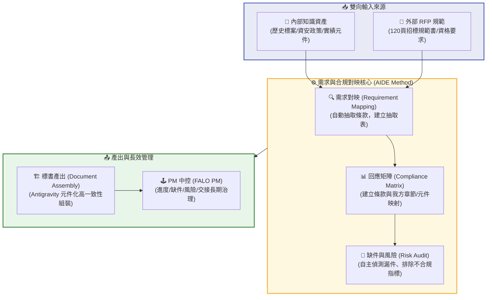

# 📋 Requirement Mapping / Compliance Mapping (需求對映與合規回應矩陣)

> **FALO 雙軌治理工作母稿 (Markdown Master Draft)**  
> **課程主題**：從過去累積到未來價值 — 企業知識資產化與 AI 應用實務  
> **Class 02 補充教學模組**：招標規範與合規對應防線  

在長文件工程中，招標書（Bidding Documents）的編製邏輯與一般的 SOP 撰寫、教材編排或企業顧問報告有著本質上的不同。SOP 或教材主要是基於「內部已有知識」的整理輸出；**然而，招標書是一場「外部強制性法規」與「內部知識資產」的精密碰撞。**

---

## 一、 核心概念：什麼是 Requirement Mapping / Compliance Mapping？

招標書不能只靠內部天馬行空的創意。它必須毫無遺漏、百分之百精準地回應外部招標文件（RFP）、招標須知、評選辦法、資格條件、附件要求、交付項目、驗收標準以及資安合規條件。

這就誕生了本課程最核心的招標心法：

> [!IMPORTANT]
> **招標書核心心法**：
> **「招標書真正要做的，是用內部知識資產，正確回應外部招標規範。」**
> 
> * 外部 RFP 規範是**「考卷」**。
> * 內部知識資產是**「歷史筆記」**。
> * **Requirement Mapping / Compliance Mapping** 就是將「考卷題目」與「歷史筆記」進行科學配對與合規檢查的**對應矩陣防線**。

---

## 二、 合規回應流程圖 (The Mapping Workflow)

以下為 AIDE 方法論中，從招標規範進件到中控管理的合規對照流程：

---

## 三、 表格範例 (Operational Templates)

### 1️⃣ 需求抽取表 (Requirement Extraction Sheet)
* **目的**：將 120 頁的 RFP 進件後，將所有需要回應的「外部條款要求」結構化抽取出來，防止漏件。
* **範例結構**：

| RFP 條款 | 要求內容 | 類型 | 重要性 | 截止日 | 負責人 | 狀態 |
| :--- | :--- | :--- | :--- | :--- | :--- | :--- |
| **第 8 條 (實績)** | 廠商須於過去 3 年內具備至少 1 案金額達 300 萬元以上之文件數位化實績。 | 資格審查門檻 | 🔴 極高 | 2026-06-01 | PM John | 🟢 已確認實績來源 |
| **第 14 條 (方法論)**| 建議書須詳述「文件數位化流程」與「知識資產化轉化路徑」。 | 評選評分項目 | 🟡 高 | 2026-06-02 | 顧問 ff | 🟡 編寫中 |
| **第 22 條 (資安)** | 投標廠商須證明符合基本資安規範，並檢附資安政策切結書。 | 資格審查門檻 | 🔴 極高 | 2026-06-01 | PM John | 🟢 已確認元件庫範本 |
| **第 35 條 (財報)** | 須檢附過去 3 年經會計師簽證之財務報表，且負債比率不得高於 60%。 | 資格審查門檻 | 🔴 極高 | 2026-06-02 | 會計 Ivy | 🔴 缺件 (待手動補件) |

---

### 2️⃣ 回應對照表 (Compliance Matrix)
* **目的**：將抽取出的「外部要求」與「我方對應章節」、「歷史資產來源」建立對照關係，並標示缺件與風險，供主管Grace審查。
* **範例結構**：

| RFP 要求 | 我方回應章節 | 可用歷史元件 | 缺件 | 風險 | 是否完成 |
| :--- | :--- | :--- | :--- | :--- | :--- |
| **REQ-01 (基本實績)** | 第三章、第二節「公司歷史績效與實例」 | `/2025年鼎盛ERP專案實績.md` | 無 | 🟢 無 | 是 |
| **REQ-02 (方法論)** | 第二章、第一節「專案執行方法論」 | `/falo_pm_methodology.md` | 待產出草稿 | 🟡 需人工潤飾白話案例 | 否 |
| **REQ-03 (資安證明)** | 附件五「星河資安維護切結書」 | `/資訊安全維護政策規範.md` | 無 | 🟢 無 | 是 |
| **REQ-04 (財務證明)** | 附件六「歷年財務查核簽證證明」 | **無對應歷史檔案** | 🔴 缺少 2023-2025 財報影本 | 🔴 **極高** (合規廢標風險) | 否 |
