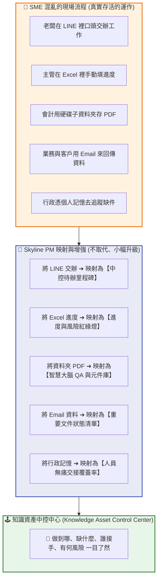

# 🕹️ Skyline PM 流程映射與知識中控方法論藍圖

本文件為 **星河 Class 02 — 企業知識資產化** 的核心管理思維總綱。

Skyline PM 的本質不是一套全新的專案管理系統（Project Management System），亦非為了取代現有的 Jira, Asana, Monday, Notion 或 Excel。

**Skyline PM 是一種「流程映射與知識中控方法論 (Knowledge Asset Control Center)」。**

> [!IMPORTANT]
> **Skyline PM 的核心宣示**：
> **「不重建工具，只映射現場；不進行大改造，只進行小幅增強。」**
> 我們的目標是透過需求訪談與流程盤點，將企業既有運作方式進行語意映射與知識資產化，轉換成一個**可查詢（Searchable）、可產出（Generatable）、可管理（Manageable）**的知識中控指揮中心。

---

## 🗺️ Skyline PM 「流程映射」概念圖

Skyline PM 就像是一面鏡子，將企業散落在 LINE、Excel 或大腦中的實體流程，無痛投影並增強為一個乾淨的中控視圖，而無需強迫員工放棄既有工具：

---

## 🛠️ Skyline PM 「小幅增強」優化邏輯

我們不要求大改流程，而是針對企業現有的行為模式，加上「小而強大」的數位安全防線：

| 🏢 SME 現有運作模式 | ⚡ Skyline PM 的「小幅增強」做法 | 💎 帶來的資產化價值 |
| :--- | :--- | :--- |
| **原本有用資料夾存檔** | 加上 **統一命名規範、智慧標籤、重要文件清單** | 檔案不再找不到，版本不再混亂 |
| **原本有用 Excel 做進度** | 加上 **狀態、缺件、風險警示、下次動作欄位** | 進度不再黑箱，主管一眼看清風險 |
| **原本有做會議紀錄** | 加上 **決議摘要、待辦分工、智慧 QA Library** | 口頭承諾轉為系統大腦，隨時引用 |
| **原本有歷史案卷/標案** | 加上 **可重用章節元件、最佳範本、參考索引** | 下次寫新文件時，Agent 可一鍵組裝 |

---

## 💎 真正管理的不是任務，而是「知識資產與脈絡」

傳統 PM 工具（如 Jira）的核心是管理 Task 與 Deadline。但 Skyline PM 的核心在於確保**「企業運營的脈絡與知識不隨人員異動而失落」**。

我們優先回答以下五個長遠的企業生存問題：
1. **這個專案累積了哪些重要知識？**
2. **目前哪一份文件是保證可用的最新版本？**
3. **如果人員明天離職，下一個人要如何 5 分鐘無痛接手？**
4. **如果專案中斷了一個月，我們如何立刻恢復當時的脈絡？**
5. **歷史問過的問題與報價潛規則，能不能被大腦隨時檢索？**

---

## 🎨 客戶版客製化中控中心（Current Stage Principles）

目前 Skyline PM 落地最適合的形式，是為每個不同客群量身打造的**「客製化中控頁 (Custom Control Tower)」**：

* 🏢 **星河標案中控** ➔ 聚焦政府招標、合規文件缺件、歷史實績元件庫。
* 🏭 **鼎盛 ERP 教學中控** ➔ 聚焦 ERP 導入流程、各模組配置 QA、新人交接進度。
* 📐 **浩宇教材與學員中控** ➔ 聚焦學員材料交付、課程排期里程碑、講義大綱組裝。
* 🔍 **TAAT 稽核專案中控** ➔ 聚焦合規查核清單、法規比對風險、Audit SOP 文件產出。

無論畫面如何客製化，底層均高度凝聚為同一個**「Skyline PM 核心檢驗清單」**：
- [ ] **流程盤點 (Process Audit)**：把真實流程對齊地圖。
- [ ] **知識資產化 (Knowledge Assetization)**：清理髒資料，形成知識大腦。
- [ ] **進度追蹤 (Progress Tracking)**：進度透明，拒絕黑箱。
- [ ] **文件狀態 (Document Status)**：重要文件建檔，拒絕漏件。
- [ ] **QA Library (大腦對接)**：新人免教，直接問大腦並獲得引用。
- [ ] **風險提醒 (Risk Alerts)**：紅綠燈防禦，避開財務與人事風險。
- [ ] **接手資訊 (Handover Info)**：脈絡留存，安心傳承。
