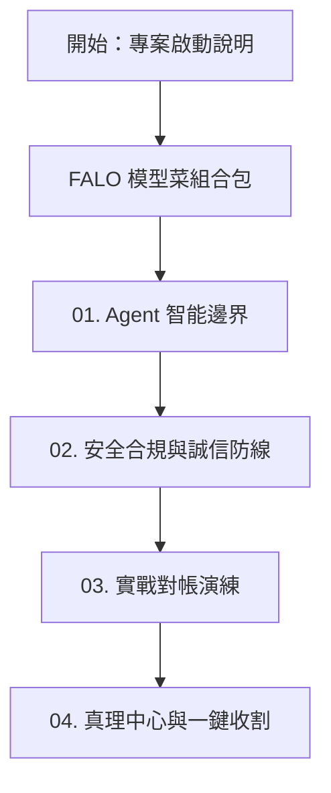

# Skyline Class02 決策指揮官工作台 (GM Workbench)

歡迎來到 **Skyline Class02 決策指揮官工作台**。本工作台專為企業最高決策者與主管設計。

我們不教您如何撰寫底層程式碼或進行瑣碎的提示詞微調。本工作台的核心目的，是向您展示：**當前最強的 Pro 等級 AI Agent (如 Antigravity / AIDE) 具備何種端到端的一條龍能耐，以及企業主管如何透過「安全、合規、誠信與控制權」這四道防線，建立可控且高效的 AI 治理工作流。**

---

## 🧭 快速導覽通道

本工作台包含完整的「模型菜實務案例」與四大核心教材單元，請依序或針對特定管理痛點進行閱讀：

* **[FALO 模型菜組合包範例](file:///Users/force/Google_Antigravity/horizon_class/skyline-class/class2/falo_set_menu.md)**
  * *「企業智能投標工作流的實戰案例」* —— 串接 ETL 轉運站、Prompt 平台、知識庫網關與 AI PM 系統的完整「模型菜」實戰。
* **[單元 01：Agent 智能邊界與指揮官思維](file:///Users/force/Google_Antigravity/horizon_class/skyline-class/class2/docs/01_course_map.md)**
  * *「從問答到一條龍 Agent 的能耐跨越」* —— 對比舊式單點問答與新式端到端工作流的 Token 消耗效率與作業極限。
* **[單元 02：企業 AI 落地之安全、合規與誠信防線](file:///Users/force/Google_Antigravity/horizon_class/skyline-class/class2/docs/02_tender_workflow.md)**
  * *「高階主管如何防禦風險？」* —— 深入探討 NotebookLM 知識庫存取分流與日誌稽核、誠信紅線拒絕幻覺，以及 Sofia 人員失效自動備降機制，並以 Chrome Built-in AI 作為未來策略拓展藍圖。
* **[單元 03：實戰對帳：智能投標工作流端到端演練](file:///Users/force/Google_Antigravity/horizon_class/skyline-class/class2/docs/03_multi_ai_collaboration.md)**
  * *「看 Agent 如何吞下政府智慧文件大標案」* —— 直擊 Agent 如何自主完成 RFP 拆解、 Delta 增量組裝、比對 2h/4h SLA 成本衝突並產出 Gap Checklist。
* **[單元 04：決策者視角：真理中心與一鍵收割同步機制](file:///Users/force/Google_Antigravity/horizon_class/skyline-class/class2/docs/04_artifact_management.md)**
  * *「如何確保決策控制權永遠在您手上？」* —— 詳解同仁協作 staging 沙盒防範知識庫污染（RAG Pollution），以及中控台「觸發式更新」與主管「一鍵收割」反向更新地端真理中心 (SSOT) 的控制鏈。

---

## 🔒 決策指揮官（總經理）防嫌指引

如果您對 AI 導入企業仍抱持懷疑，建議您從以下痛點問題直接切入：

### ❓ 1. AI 會不會把公司極敏感的財務資料或商業機密洩漏上雲？
> **防線解答**：
> 我們在實務落地以 **AI NotebookLM 的存取管制與稽核日誌** 為核心主軸。系統透過中介網關限制一般同仁僅能閱讀「已獲得授權的特定知識庫」（如歷史得標案例庫），無法越權讀取敏感財務原件。同時，系統會自動留存完整查詢與對話稽核日誌，滿足企業的合規安全管理。
> 此外，針對極敏感數據（如財務報表或去重清洗），我們預留了 **地端本機安全沙盒與 Built-in AI (Gemini Nano)** 作為未來高階合作的擴展技術藍圖，在 100% 斷網的本機進行去敏感化前置處理。
> * 📄 詳見：**[單元 02：企業 AI 落地之安全、合規與誠信防線](file:///Users/force/Google_Antigravity/horizon_class/skyline-class/class2/docs/02_tender_workflow.md)**

### ❓ 2. AI 經常胡說八道（幻覺），如果寫錯標書或契約導致廢標，誰來負責？
> **防線解答**：
> 我們建立了 **「誠信紅線」** 與 **「Sofia 自動備降機制」**。AI 在比對實績時，若發現鼎盛專案缺少簽章公文，會強制遵循誠信鐵律拒絕編造，自動報警排除，並主動啟用 Sophia 作為合規備降 PM。
> * 📄 詳見：**[單元 03：實戰對帳：智能投標工作流端到端演練](file:///Users/force/Google_Antigravity/horizon_class/skyline-class/class2/docs/03_multi_ai_collaboration.md)**

### ❓ 3. 一般同仁使用 AI 自由度太高，各問各的，公司知識資產如何沉澱，我又該如何控管？
> **防線解答**：
> 同仁的自由發揮僅在雲端 Staging 協作沙盒中進行。當 AI 驗證該產出通過雙軌合規時，系統會自動在主管中控台彈出 **「觸發式同步提醒」**。沒有您的 **「一鍵收割」** 授權，任何數據都不會更新回地端真理中心 (SSOT)。
> * 📄 詳見：**[單元 04：決策者視角：真理中心與一鍵收割同步機制](file:///Users/force/Google_Antigravity/horizon_class/skyline-class/class2/docs/04_artifact_management.md)**
