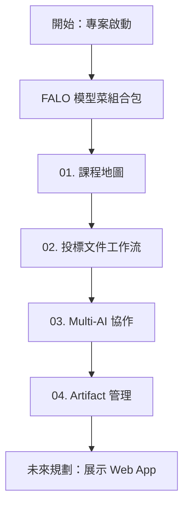

# Skyline Class02 教材工作台主控台 (Workbench)

歡迎來到 Skyline Class02 教材工作台。本工作台是為了協助學員與企業主管快速理解 **「AI 如何從聊天對話框轉型為企業工作流」** 的實作示範基地。

在這裡，我們以一個典型的企業情境——**「投標文件與大型合約協作」** 為主軸，解構如何利用不同的 AI 角色與管理工具，建立一個自動化、可治理的 AI 文件工程。

---

## 🧭 快速導覽通道

本工作台包含完整的引導與四大核心教材單元，請依序或針對特定主題進行閱讀：

* **[FALO 模型菜組合包範例](file:///Users/force/Google_Antigravity/horizon_class/skyline-class/class2/falo_set_menu.md)**
  * *「企業智能投標工作流的實戰案例」* —— 串接 ETL 轉運站、Prompt 平台、知識庫網關與 AI PM 系統的完整「模型菜」。
* **[單元 01：課程地圖](file:///Users/force/Google_Antigravity/horizon_class/skyline-class/class2/docs/01_course_map.md)**
  * *「從問答到工作流的思維轉變」* —— 理解 Horizon 到 Skyline 的學習路徑，以及 Class02 的核心知識點。
* **[單元 02：投標文件工作流說明](file:///Users/force/Google_Antigravity/horizon_class/skyline-class/class2/docs/02_tender_workflow.md)**
  * *「如何用 AI 吞下大型投標文件？」* —— 解析企業在處理大型 RFP（需求建議書）時的痛點，以及如何建立端到端（End-to-End）的 AI 工作流。
* **[單元 03：Multi-AI 協作說明](file:///Users/force/Google_Antigravity/horizon_class/skyline-class/class2/docs/03_multi_ai_collaboration.md)**
  * *「當 NotebookLM 遇上 Antigravity 與 FALO PM」* —— 說明三個核心工具/角色在工作流中扮演的「理解、整理、管理」鐵三角。
* **[單元 04：Artifact 管理機制](file:///Users/force/Google_Antigravity/horizon_class/skyline-class/class2/docs/04_artifact_management.md)**
  * *「把 AI 的產出變成企業真正的資產」* —— 說明如何建立 AI 產出物的生命週期管理、命名規範與品質審查門檻。

---

## 🎯 依角色情境導讀

如果您是不同背景的讀者，建議可以從以下情境切入：

### 💼 我是企業主管 / 決策者
> 您最關心的是 **AI 能否落地、降低風險與提高產出效率**。
> * 建議閱讀順序：
>   1. [02 投標文件工作流說明](file:///Users/force/Google_Antigravity/skyline/skyline-class/class2/docs/02_tender_workflow.md) (理解商業價值與痛點解決)
>   2. [04 Artifact 管理機制](file:///Users/force/Google_Antigravity/skyline/skyline-class/class2/docs/04_artifact_management.md) (理解如何實施品質治理與控管風險)

### 📋 我是專案經理 (PM) / 流程規劃者
> 您關心的是 **AI 之間如何協同工作、進度如何追蹤**。
> * 建議閱讀順序：
>   1.💡 建議優先閱讀：<a href="../docs/01_course_map.html">01 課程地圖</a> (理解整體知識框架與實踐步驟)。

### 💻 我是教材工程師 / 展示開發者
> 您關心的是 **Markdown 文件工程、檔案結構與前端 Demo 展示**。
> * 建議優先閱讀：
>   1. [01 課程地圖](file:///Users/force/Google_Antigravity/skyline/skyline-class/class2/docs/01_course_map.md) (熟悉整體 Repo 結構)
>   2. 閱讀 `README.md` 中關於 [主力產線任務與團隊角色](file:///Users/force/Google_Antigravity/skyline/skyline-class/class2/README.md) 的設定。

## 🚀 未來展示規劃
在後續的專案推進中，我們將在 `demo/` 目錄中建立一個 HTML/CSS/JS 的實體網頁展示，將這套投標文件工作流與 Multi-AI 的協作過程視覺化，讓企業主管能以最直覺的方式體驗 AI 治理的威力。

---

## 📚 歷史版本參考 (Class 02 Antigravity 原始交付包)

我們已將講師 **ff (Force)** 顧問實戰沉澱的 Class 02 原始知識骨架與 AIDE 長文件工程交付母稿收錄於此，供後續重構參考：
* **[講師實際教學交付母稿 (class02_teaching_delivery_pack.md)](file:///Users/force/Google_Antigravity/horizon_class/skyline-class/class2/reference/class02-antigravity/class02_teaching_delivery_pack.md)**：3 小時精準課程流向、授課逐字稿、SLA衝突/誠信紅線/PM備降等 AIDE 雙軌對帳 Live Demo 指令集。
* **[學員實作手冊指南 (class02_practice_workbook.md)](file:///Users/force/Google_Antigravity/horizon_class/skyline-class/class2/reference/class02-antigravity/class02_practice_workbook.md)**：八大關鍵步驟的 AIDE 長文件工程實作指南。
* **[知識工程心得沉澱 (knowledge_engineering_lessons_learned.md)](file:///Users/force/Google_Antigravity/horizon_class/skyline-class/class2/reference/class02-antigravity/knowledge_engineering_lessons_learned.md)**：記錄了 *「不要把長文件當文章寫，要把文件當代碼來編譯與治理 (Document as Code)」* 的核心方法論發現。
* **[下載完整交付包 (class02-antigravity.zip)](file:///Users/force/Google_Antigravity/horizon_class/skyline-class/class2/reference/class02-antigravity.zip)**：包含模擬招標書（RFP）、內部實績元件、學員空白模板、大腦引導規章及預期產出文件等完整數據庫。
